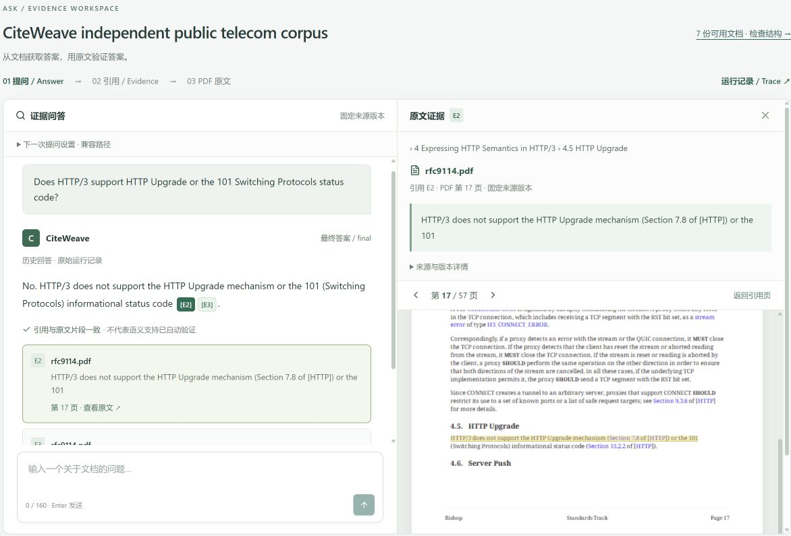
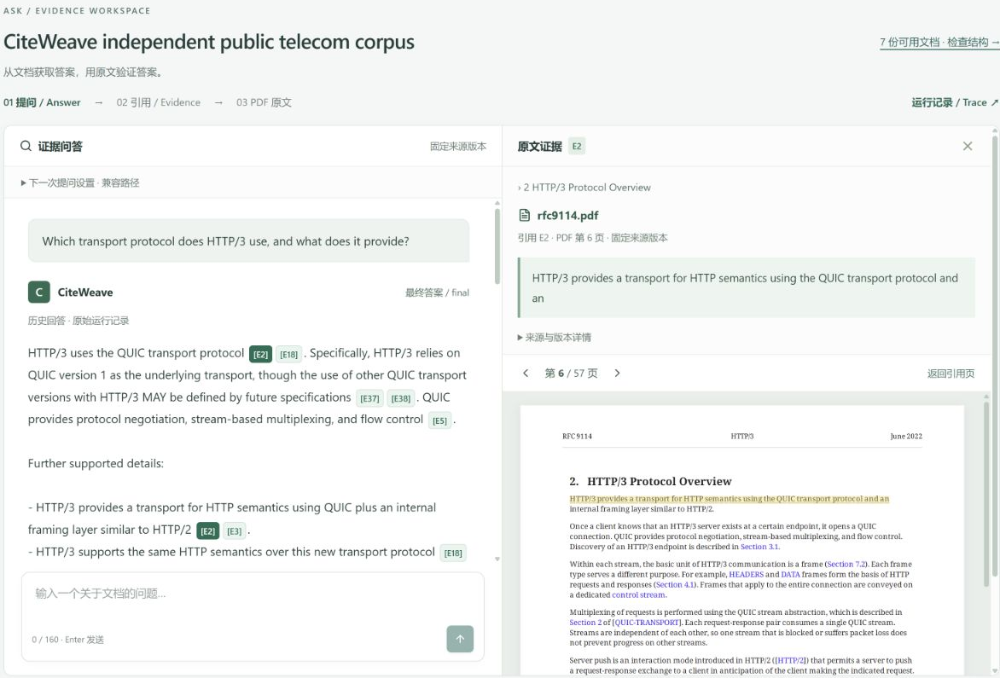
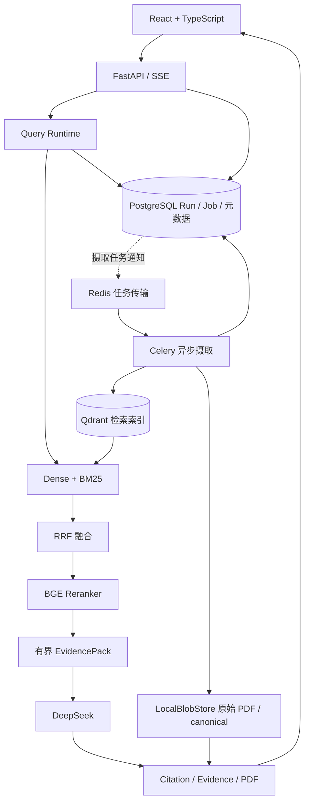

# CiteWeave

**面向技术文档的证据问答工作台，让每一条引用都能回到原文。**

[](https://github.com/BillZhao626/CiteWeave/actions/workflows/ci.yml)
[](LICENSE)

从答案出发，点击 Citation，检查 Evidence，再定位到固定版本的 PDF。CiteWeave 将结构化检索、引用追溯与运行记录放进同一个 React 工作台。



*真实产品截图：查询 RFC 9114 的 HTTP Upgrade 规则。截图仅裁剪展示区域；引用编号是产品中的证据标识。RFC 摘录归属见[第三方声明](THIRD_PARTY_NOTICES.md)。*

## 为什么做 CiteWeave

技术文档问答的困难不止是生成流畅的答案：规则藏在章节与条款里，证据可能被切片截断，读者还需要确认“这句话来自哪份文档、哪个版本、哪一页”。

CiteWeave 围绕这些检查动作设计：保留文档结构和原始几何位置，用混合检索找到相关片段，用有界上下文组织证据，并把最终引用绑定到不可变来源。它是个人独立实现的工程项目，适合阅读 RAG 服务化、可追溯交互与持久任务的实现。

## 核心体验

1. **Answer**：选择知识库与文档范围，提出问题；SSE 区分生成中的草稿和校验后的最终答案。
2. **Citation**：点击答案中的引用，查看对应文档和版本。
3. **Evidence**：核对原文片段、所属条款与来源位置。
4. **PDF**：跳转原始 PDF 页并高亮证据区域。



*这是另一条真实查询，用于展示 PDF 定位；两张截图不表示同一次查询的连续操作。引用定位正确不等于答案的语义支持已被自动证明。*

## 核心能力

| 能力 | 实现与用途 |
| --- | --- |
| Structure-aware parsing | 保留 Section / Clause 层级、Parent / Child 关系及 EvidenceSpan membership，可在界面检查结构 |
| 混合检索与精排 | E5 Dense + BM25 双分支召回，RRF 融合，BGE Reranker 精排 |
| 有界证据组织 | Child 用于检索；Parent 提供受预算约束的周边上下文，EvidencePack 记录选入来源与覆盖情况 |
| 版本化原文追溯 | 原始 PDF 与 canonical 保存在内容寻址的 LocalBlobStore，引用绑定固定版本与持久化 span |
| 异步摄取 | Redis 传输任务，Celery 执行解析、编码与索引，PostgreSQL 保存 Job 生命周期 |
| Runs / Trace | 查看模型、prompt、执行阶段、耗时与引用关联；保留真实记录，不给扩展上下文虚构检索分数 |
| 工程边界 | OpenAPI 类型、Alembic 迁移、状态机、幂等约束、超时与取消记录，以及独立的离线回归检查 |

## 系统架构



PostgreSQL 是业务状态的持久依据；Qdrant 是可重建的检索索引。Redis 的当前验证职责是任务传输。Celery 的产品验证覆盖独立样本的异步摄取成功路径；不将它表述为通用生产评测 worker。详见[架构说明](docs/ARCHITECTURE.md)。

## 技术栈

| 层 | 技术 |
| --- | --- |
| 前端 | React、TypeScript、Vite、TanStack Query、React Router、Tailwind、PDF.js |
| API 与运行时 | Python 3.12、FastAPI、SSE、Pydantic、SQLAlchemy、Alembic |
| 数据与任务 | PostgreSQL、Qdrant、Redis、Celery、LocalBlobStore |
| 检索与生成 | multilingual-e5-small、BM25、RRF、bge-reranker-v2-m3、DeepSeek |
| 检查与交付 | pytest、Ruff、ESLint、Vitest、Docker Compose、GitHub Actions |

## 快速开始

### 先运行无需模型的代码检查

需要 Python 3.12、Node 22.20+、pnpm 11.19.0 和 uv 0.12.13。依赖安装需要网络；检查本身不需要 API Key、模型权重、数据库或私有语料。

```powershell
git clone https://github.com/BillZhao626/CiteWeave.git
cd CiteWeave
python -m pip install uv==0.12.13
uv sync --frozen
corepack enable
corepack prepare pnpm@11.19.0 --activate
pnpm --dir apps/web install --frozen-lockfile
uv run --frozen python scripts/check_release.py
```

如果 Node 安装目录不允许 `corepack enable` 写入，可直接安装指定版本的 pnpm。检查入口会执行后端 lint / format / 离线测试，以及前端 typecheck / lint / Vitest / build。Compose 的静态配置检查见[本地运行说明](docs/QUICKSTART.md)。

### 启动完整工作台

目前完整运行的验证环境是 **Windows 11 + PowerShell 7 + Docker Desktop + NVIDIA CUDA**，参考机器为 16 GB 内存、8 GB 显存。CPU-only 和 Linux 完整部署尚未验证。下面的命令会下载公开模型并构建本地服务：

```powershell
.\scripts\m1.ps1 -Setup
```

打开 [localhost:18080](http://127.0.0.1:18080/)，使用脚本在本地 `.env` 中生成的 `CW_ADMIN_TOKEN` 登录。不要把 `.env` 提交到 Git。创建知识库后，可先上传仓库自带的原创[两页手册](apps/web/public/original-handbook.pdf)。

**真实回答需要用户自己的 `DEEPSEEK_API_KEY`，并会产生提供商费用。** 将它设为启动终端的环境变量后重新运行 `scripts/m1.ps1 -Action Up`。没有 Key 时可以检查已有文档、证据和运行记录，不能得到真实生成答案。新克隆不会包含截图中的既有文档和查询记录。

七份公开文档的获取、结构化上传参数、截图所用 prompt 配置与停机方式见[完整快速开始](docs/QUICKSTART.md)。保留脚本历史文件名是为了兼容已有部署布局。

## 文档与公开语料

当前产品展示使用七份公开技术文档：RFC 9293、RFC 9114、RFC 9110、RFC 9846、RFC 9673、RFC 9175，以及 MQTT 5.0 OASIS Standard。

仓库提供来源 URL、版本、哈希和下载脚本；**不打包标准 PDF、模型权重、向量库或私人历史语料**。使用者从官方来源获取原件并保留其声明。

- [语料与许可边界](docs/CORPUS.md)
- [架构与职责](docs/ARCHITECTURE.md)
- [本地安装、结构化摄取与配置](docs/QUICKSTART.md)
- [工程文档索引](docs/README.md)

## 工程与评测方法

回归检查关注引用身份、证据边界、结构解析、检索融合、任务状态与前端流式事件。需要数据库、服务或模型的集成测试与离线 CI 分开；离线通过不能替代真实服务验证。

评测实现区分检索覆盖、引用位置有效性与答案语义支持。自动 Judge 不可用时保留缺失状态；公开来源辅助制作的参考标注不等于独立人工 Gold。项目不把一次成功问答、单次耗时或合成样本结果当作普遍质量和容量结论。

## 从 General Assistant V2 到 CiteWeave

General Assistant V2 是前期原型与工程验证的历史背景。CiteWeave 在个人独立重建中强化了交互、组件职责、持久状态、异步摄取和执行可观察性；这里不声称直接继承历史代码，也不公开历史私有材料。

历史作品集中的 19 文档规模、质量、性能与可靠性结果属于原型阶段，不是当前七文档语料的实测成绩。当前 React、Celery、BGE 和 Qdrant 的实现也不用于反推它们在历史实习期的交付时间或迁移过程。README 不重复缺少独立证据的历史提升区间或部署主张。

## 项目结构

```text
apps/web/           React 工作台与前端测试
src/citeweave/      API、查询、摄取、证据与评测运行时
migrations/         Alembic 数据迁移
tests/              原创 fixtures、离线与集成测试
deploy/             Dockerfile 与 Compose
scripts/            安装、检查、语料获取与工程工具
corpus/             官方来源元数据与哈希
evals/              公开来源评测定义与归属声明
contracts/          OpenAPI 与证据 schema
docs/               架构、运行与许可说明
```

## 已知边界

- 当前为面向本地工程展示的 alpha，不承诺生产 SLA、企业安全认证或特定并发容量。
- 结构解析受 PDF 字体映射、布局与来源质量影响；复杂表格、扫描件与任意 PDF 的通用正确性未验证。
- 引用有效性不等于事实正确；证据不足示例不构成对所有无答案问题的可靠拒答保证。
- 单文档查询有产品验证；跨知识库比较尚无完整端到端质量验证。
- 异步摄取验证来自独立原创样本，不代表七份展示文档均经同一 worker 重新摄取，也不代表生产故障场景已全面通过。
- 默认查询并发限制为 1；实际费用与提供商账单、模型下载资源需求需由运行者确认。

## License / Third-party notices

原创 CiteWeave 代码采用 [MIT License](LICENSE)。标准摘录、模型、依赖、字体与 PDF.js 保留各自条款，MIT 不对它们重新授权。详见 [THIRD_PARTY_NOTICES.md](THIRD_PARTY_NOTICES.md) 和[语料说明](docs/CORPUS.md)。
