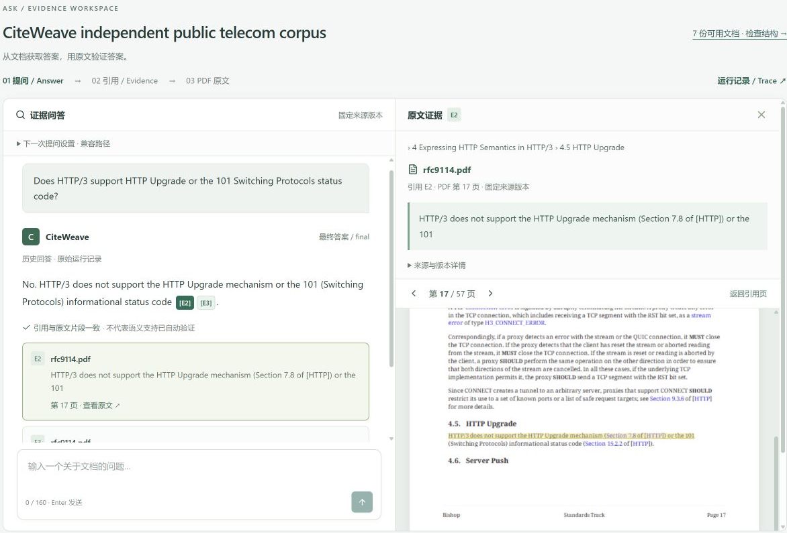
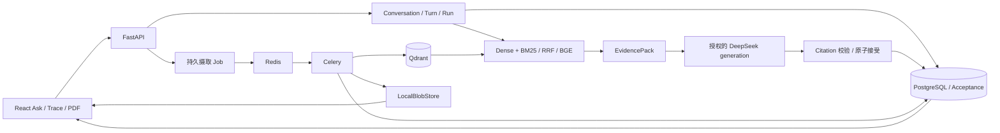

# CiteWeave

**面向技术文档的证据问答工作台，让答案中的引用回到不可变原文。**

[](https://github.com/BillZhao626/CiteWeave/actions/workflows/ci.yml)
[](LICENSE)

当前源码版本为 **0.2.0**；稳定版本与发布状态以 GitHub Tags / Releases 为准。历史 `v0.1.0` 标签继续保留。

## 项目来源与公开边界

作者曾参与浙江大学杭州国际科创中心（Zhejiang University Hangzhou International Science and Technology Innovation Center）的通信领域 RAG 工程项目，与导师及团队保持密切技术沟通，并参与团队 Gitee 工程组织及系统向团队服务器、服务化形态的迁移。CiteWeave 延续并深化了这些工程经验。

本 GitHub 仓库是作者独立维护、去标识化的公开重建，独立实现代码，使用公开或原创数据演示。它不是团队内部 Gitee 仓库的镜像或公开发布，也不是机构官方仓库；机构不因此为后续独立修改背书。仓库不包含或再分发内部代码、私有数据、专有数据集、保密文档、商业材料、凭据或其他非公开团队资产。

## Answer → Citation → Evidence → PDF

在 Ask 选择知识库与固定文档版本，提交问题；从已接受的答案点击 Citation，核对 Evidence 原文片段，再定位 PDF 页与几何高亮。引用绑定授权的不可变版本及精确 span；物理引用有效性不能自动证明语义支持。



*历史真实产品截图：RFC 9114 查询，仅裁剪展示区域。新安装不含截图的语料或记录；RFC 摘录归属见[第三方声明](THIRD_PARTY_NOTICES.md)。*

## v0.2 系统与持久运行时

React 19 / TypeScript / Vite 工作台使用 Pydantic / OpenAPI 生成的类型访问 FastAPI。SQLAlchemy 2 / Alembic 管理持久状态；检索为 E5 Dense + BM25、RRF 融合、BGE 精排和有界 EvidencePack。


```mermaid
flowchart LR
    UI[React Ask / Trace / PDF] --> API[FastAPI]
    API --> Runtime[Conversation / Turn / Run]
    Runtime --> PG[(PostgreSQL / Acceptance)]
    Runtime --> Retrieval[Dense + BM25 / RRF / BGE]
    QD[(Qdrant)] --> Retrieval
    Retrieval --> Pack[EvidencePack]
    Pack --> Generation[授权的 DeepSeek generation]
    Generation --> Validate[Citation 校验 / 原子接受]
    Validate --> PG
    PG --> UI
    API --> Jobs[持久摄取 Job]
    Jobs --> Redis[Redis]
    Redis --> Worker[Celery]
    Worker --> PG
    Worker --> QD
    Worker --> Blob[LocalBlobStore]
    Blob --> UI
```

Conversation 保存会话 scope/head，Turn 保存不可变原始请求，Run 表示执行尝试。Acceptance 将 result、Working State、head 和 Run 终态原子发布。UI 通过稳定幂等 key 恢复身份并读取持久结果；会话 SSE 是有限快照。单轮旧路径的草稿与校验后最终结果分开，未校验草稿不能成为最终答案。History / State 是上下文，不是文献证据。详见[当前架构](docs/ARCHITECTURE.md)。

可靠性覆盖持久幂等准入、有界安全 retry、UNKNOWN 禁止重派、取消、过期结果 fencing，以及重启后的显式人工恢复。执行允许至少一次，保证的是有效结果幂等；取消不保证停止上游计算。见[可靠性证据](docs/V02B_RUNTIME_RELIABILITY_M1.md)。

认证后的 Trace Inspector 展示持久 Run 生命周期、阶段/错误诊断、可用耗时与安全计量。恢复 CLI 支持有界只读 inspection 与显式 reconciliation；provider-free drills 覆盖恢复状态，不构成生产监控或 SLO。见[可观察性与恢复](docs/V02B_OPERATIONAL_OBSERVABILITY_M2.md)。

## 本地并发证据

已合并的[并发/性能工作](docs/V02B_CONCURRENCY_PERFORMANCE_M3.md)使用真实 loopback HTTP / PostgreSQL 和合成模型、检索、提供商响应。Acceptance 内递归借用 PG 连接及 scope reader 独占锁造成争用；复用 Session 与共享读锁降低了冻结工作量中的争用。

| 冻结 Profile A | 优化前 → 优化后 |
| --- | --- |
| concurrency5 p95 | 2824.3 → 1943.7 ms（-31.2%） |
| concurrency5 成功吞吐 | 1.919 → 2.925 workflow/s（+52.4%） |
| concurrency10 成功数 | 12/120 → 120/120 |
| concurrency20 成功数 | 116/120；观测到失败起点，未认证稳定容量 |

独立 Profile B 加入真实本地 Qdrant，但仅三条原创数据及合成二维 embedding。M2 记录成本是 inclusive 计时，不是无记录系统的反事实增量。这些证据不能换算为生产 QPS、SLA/SLO、云容量、通用用户并发或真实 DeepSeek/E5/BGE 吞吐。

## 摄取与数据职责

逻辑 Document 与不可变 DocumentVersion 分开；异步解析、编码、写索引由 Celery 执行，只有持久 READY 提交后才开放索引。PostgreSQL 是业务权威，Qdrant 是可重建索引，Redis 是可恢复的任务传输，LocalBlobStore 保存原始 PDF / canonical。会话同步查询不经过 Redis/Celery。

## 可复现验证与启动

需要 Python 3.12、Node 22.20+、pnpm 11.19.0、uv 0.12.13。依赖安装需要网络；Tier A 检查无需 `.env`、服务、模型、Key 或私有语料。

```powershell
git clone https://github.com/BillZhao626/CiteWeave.git
cd CiteWeave
python -m pip install uv==0.12.13
uv sync --frozen
corepack enable
corepack prepare pnpm@11.19.0 --activate
pnpm --dir apps/web install --frozen-lockfile
uv run --frozen python scripts/check_release.py
```

这是安装入口示例；本次本地候选的准确基线及干净导出验证见[发布准备](docs/V02_RELEASE_READINESS.md)。Tier B 使用真实 Compose/镜像及全新临时卷，验证 PG/Redis/Qdrant、迁移、API、静态前端与空队列 worker，不执行摄取、模型推理或生成：

```powershell
uv run --frozen python scripts/smoke_release.py
```

Tier C 完整工作台已支持 Windows 11 / PowerShell 7 / Docker Desktop Linux containers / NVIDIA CUDA 12.6，参考机 16 GB RAM / 8 GB VRAM。执行 `.\scripts\m1.ps1 -Setup` 下载锁定模型并启动 E5/BGE gateway；访问[本地工作台](http://127.0.0.1:18080/)，使用脚本生成到忽略 `.env` 的 admin token。具体启动、停止、升级备份与授权边界见[QUICKSTART](docs/QUICKSTART.md)。

## 当前限制

- 本地工程发布候选不承诺生产可用性、SLA/SLO 或特定容量；Linux/CPU-only 完整模型工作台未验证，跨平台离线 CI 与无模型 Linux 容器烟测范围不同。
- 默认 Conversation runtime fail-closed / unavailable；API readiness 只表示持久 API 就绪。真实会话需服务器端准确 policy/tokenizer、有限 calls/token/CNY/deadline 授权与本地模型。仅设置 Key 不会开放会话。
- 旧单轮真实生成需要用户自己的 `DEEPSEEK_API_KEY`，会计费。公开 CI 不运行模型/提供商；本次 readiness 调用与支出均为零。
- PDF 解析受字体和布局影响；扫描件、复杂表格、任意 PDF、跨库语义质量和生产数据升级/备份恢复尚无完整验证。
- 合成回归、恢复 drills 和引用定位不证明通用语义质量。历史 UNKNOWN 保留其不确定性，旧付费授权不可复用。

## 文档、语料与许可

从[文档地图](docs/README.md)进入架构、恢复、并发与发布证据。仓库提供七份公开技术文档的来源、版本、哈希及下载脚本，原始标准 PDF、模型、数据库与历史记录不随 Git 发布。公开可下载不代表可再分发，使用者须保留来源条款。原创两页手册可作空库示例。

原创代码采用 [MIT](LICENSE)，第三方标准摘录、模型、依赖、字体及 PDF.js 保留各自许可。参见[语料说明](docs/CORPUS.md)、[数据声明](docs/DATA_NOTICES.md)和[第三方声明](THIRD_PARTY_NOTICES.md)。
