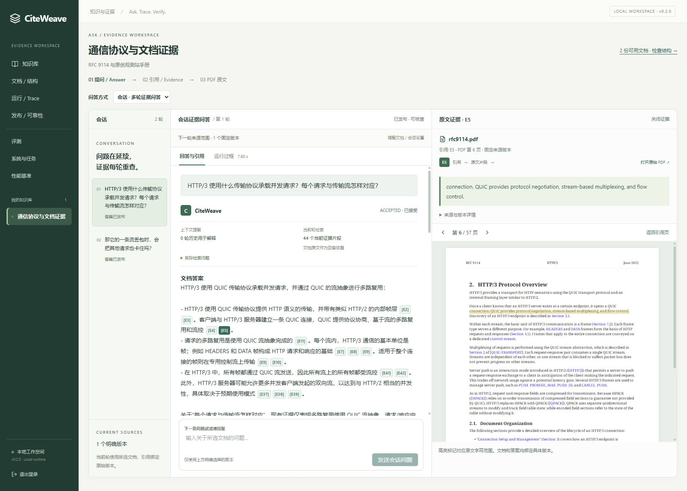
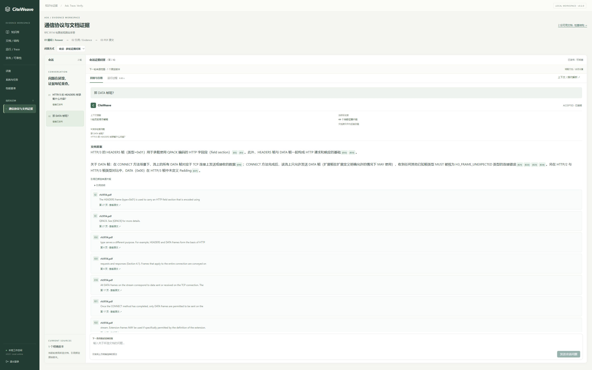
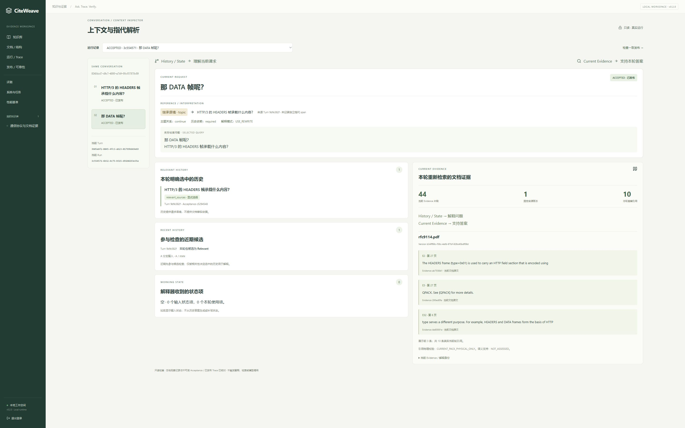
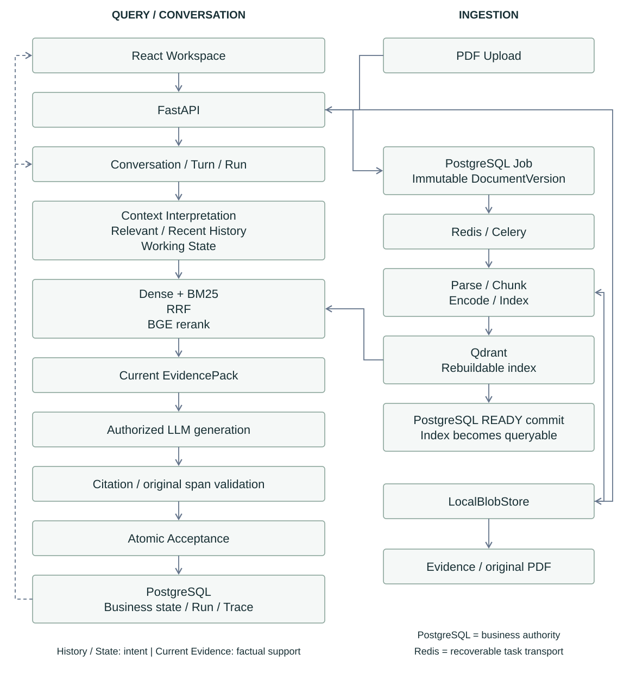

# CiteWeave

**面向技术文档的证据问答工作台：Answer → Citation → Evidence → PDF**

React / TypeScript / FastAPI / PostgreSQL / Redis / Celery / Qdrant

[](https://github.com/BillZhao626/CiteWeave/actions/workflows/ci.yml)
[](LICENSE)

选择知识库与不可变文档版本，提问后从答案中的 Citation 回到 Evidence 原文，再定位 PDF 页与高亮。引用绑定授权的版本和精确 span；原文匹配有效，不等于答案已获得语义支持。



## 多轮问答与上下文检查

Conversation 保存会话范围与已发布 head，Turn 保存原始请求，Run 保存一次执行。后续问题通过有界历史选择和指代／省略解析形成当前查询，再重新检索文档证据。Relevant History 是实际声明相关的历史来源；Recent History 是近期候选，两者不等同。Working State 只继承实际存在且仍有效的结构化状态。



Context Inspector 分开展示历史候选、相关来源、近期来源、输入状态、解析结果和当前 Evidence。持久 Trace 提供已记录的查询与使用身份；可选本地观察记录只有与持久身份及请求／响应哈希核对后才展示细节，缺失或不可验证时明确标注。候选分支与近期归属属于本地观察。历史问题和状态帮助理解意图，历史答案不会成为本轮文档证据。



这三张图片均来自真实运行界面，未重绘产品像素。新安装不包含图片中的语料或历史记录；RFC 9114 摘录归属见[第三方声明](THIRD_PARTY_NOTICES.md)。

## 架构



图由 [`scripts/generate_readme_architecture.py`](scripts/generate_readme_architecture.py) 生成，使用原生 SVG 文字与显式留白，避免 GitHub 交互式图表裁切标签。

PostgreSQL 是业务权威；Qdrant 是可重建索引；Redis 是可恢复的任务传输。逻辑 Document 与不可变 DocumentVersion 分开，索引只在持久 READY 提交后开放。同步 Conversation 查询不经过 Redis/Celery。详见[架构](docs/ARCHITECTURE.md)与[API](docs/API.md)。

## 工程能力

- **证据身份**：E5 Dense + BM25、RRF 融合与 BGE 精排生成有界 EvidencePack；引用解析授权来源版本、精确原文区间和 PDF 位置。
- **一致发布**：Acceptance 在同一事务发布答案、下一轮状态、Conversation head 和 Run 终态。UI 使用稳定幂等 key 恢复身份并读取持久结果。
- **可靠执行**：有界安全 retry、UNKNOWN 禁止自动重派、取消与过期结果 fencing；持久 Trace 支持诊断，恢复与 reconciliation 显式执行。至少一次执行保证有效结果幂等，取消不能保证停止上游计算。
- **并发事务**：Acceptance 复用 SQLAlchemy Session，避免同一 Transaction 递归 checkout 耗尽 Connection Pool；只读来源检查使用 PostgreSQL `SELECT … FOR SHARE`，保留来源修改与发布的锁约束。

本地合成 HTTP/PostgreSQL 工作量在并发 5 时，优化前后 p95 为 **2824.3 → 1943.7 ms（−31.2%）**，成功吞吐为 **1.919 → 2.925 workflow/s（+52.4%）**。模型、检索与提供商响应是合成的；这是指定工作量的观测结果。方法、失败分母与复现边界见[并发测量](docs/V02B_CONCURRENCY_PERFORMANCE_M3.md)。

## 快速开始与验证

准备 Python 3.12、Node 22.20+、pnpm 11.19.0。在仓库根目录运行：

```powershell
git clone https://github.com/BillZhao626/CiteWeave.git
cd CiteWeave
python -m pip install uv==0.12.13
uv sync --frozen
pnpm --dir apps/web install --frozen-lockfile
uv run --frozen python scripts/check_release.py
```

安装需网络；检查本身无需 `.env`、服务、模型或 Key，覆盖后端 lint/format/离线测试、生成 API 类型一致性、前端测试/lint/typecheck/build 与文档链接。真实服务的隔离烟测使用 `uv run --frozen python scripts/smoke_release.py`。

Windows 11 / PowerShell 7 / Docker Desktop Linux containers / NVIDIA CUDA 12.6 的完整工作台使用 `./scripts/m1.ps1 -Setup`；该命令下载锁定模型并启动本项目服务。打开 [本地工作台](http://127.0.0.1:18080/)，使用本机生成的 admin token 登录。详细依赖、停止、集成验证和备份步骤见[快速开始](docs/QUICKSTART.md)。

默认 Conversation runtime 不开放新执行。真实会话需要服务器端匹配请求的有限调用/token/CNY/期限授权、校验过的 tokenizer、本地模型及提供商 Key；仅设置 Key 不会开放会话。真实生成会计费，公开 CI 不调用提供商。现有文档、Run、Trace 和检查页面可按授权读取。

## 发布与边界

最新正式发布为 **[v0.2.0](https://github.com/BillZhao626/CiteWeave/releases/tag/v0.2.0)**；`main` 持续开发发布后的 **Unreleased** 改进，包与 API 元数据仍为 `0.2.0`。

本项目为个人独立实现和维护的证据 RAG。仓库不包含或再分发前雇主／团队内部代码、私有语料、专有文档或凭据，来源边界见[说明](docs/PROVENANCE.md)。本地回归、真实单例运行和引用定位不证明通用语义质量或生产容量；完整 Linux/CPU-only 模型部署及生产数据升级恢复尚未验证。

原创代码采用 [MIT](LICENSE)。模型、依赖和第三方摘录保留各自条款；完整标准 PDF、模型、数据库、索引及本地运行记录不随 Git 发布。参见[语料](docs/CORPUS.md)、[数据声明](docs/DATA_NOTICES.md)、[第三方声明](THIRD_PARTY_NOTICES.md)和[文档地图](docs/README.md)。
