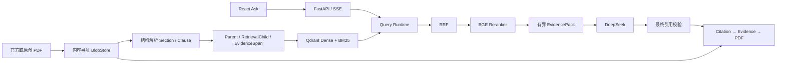

# 架构与职责

CiteWeave 使用 React + TypeScript 工作台和 FastAPI API。同步查询通过 SSE 返回草稿及最终结果；文档摄取交给异步 worker。前端类型由 Pydantic / OpenAPI 生成。

```mermaid
flowchart LR
    PDF[官方或原创 PDF] --> Blob[内容寻址 BlobStore]
    Blob --> Parse[结构解析 Section / Clause]
    Parse --> Parent[Parent / RetrievalChild / EvidenceSpan]
    Parent --> Index[Qdrant Dense + BM25]
    Ask[React Ask] --> API[FastAPI / SSE]
    API --> Query[Query Runtime]
    Index --> Query
    Query --> RRF[RRF]
    RRF --> BGE[BGE Reranker]
    BGE --> Pack[有界 EvidencePack]
    Pack --> Model[DeepSeek]
    Model --> Validate[最终引用校验]
    Validate --> View[Citation → Evidence → PDF]
    Blob --> View
```

## 数据归属

| 组件 | 责任 | 边界 |
| --- | --- | --- |
| PostgreSQL | 文档版本、Run / Job、状态与期限、执行记录、持久化元数据 | 不作为向量召回引擎 |
| Qdrant | 带类型与版本约束的可重建 Dense / BM25 检索索引 | 不作为业务生命周期的唯一真相或 PDF 备份 |
| Redis | Celery 任务通知传输 | 未验证为通用生产缓存 |
| Celery | 异步解析、编码、写索引；业务状态回写 PostgreSQL | 未验证为通用生产评测 worker |
| LocalBlobStore | 不可变原始 PDF 与 canonical artifacts | 未部署云对象存储 |

查询以 Child 召回，使用 E5-small 编码、BM25 与 RRF（k=60）融合，再由 bge-reranker-v2-m3 精排。Parent 扩展保留来源，并受证据数量与 token 预算约束。EvidencePack 将 seed、heading、sibling 等来源关联到原始 span。最终引用指向 EvidenceSpan 身份，不是临时检索排名。

文档、版本、解析器及来源哈希固定后才能绑定可检查的证据。PDF.js 使用保存的页码与几何位置高亮原始文件。结构页不通过临时重新解析覆盖已有证据；旧 Run 保留原 profile 与来源身份。

## 任务与查询

摄取任务先持久化，再经 Redis 通知 Celery；worker 的状态转换和索引发布受持久状态约束。索引只在 READY 提交后对查询开放。重试、取消、超时与不确定提供商结果有显式记录；实现中存在保护不等于每种生产故障均经过验证。

当前产品验证覆盖真实检索、DeepSeek 问答、引用到 PDF 和独立样本的异步摄取成功路径。评测调度和恢复的实现可供阅读，但不能由摄取测试推出生产评测 consumer 已验证。

## 实现入口

### v0.2a 内部 Conversation Core（Implementation #1）

独立授权的持久核心已实现，尚未接入公开 API/UI 或模型执行。PostgreSQL `cw5_conversations / cw5_turns / cw5_runs / cw5_acceptances` 保存会话、不可变原始请求、相关执行尝试和不可变接受记录；v0.1 QueryRun、单轮问答、摄取和证据 reader 不改变。

`conversations.py` 在短事务中锁定 Conversation，检查 workspace/显式 KB 与版本范围、幂等 fingerprint、expected head 和单活动执行。部分唯一索引限制活动 Run；单调 fence、owner 和显式 deadline 阻止迟到接受。同 key 同请求读回原身份，异内容冲突；独立请求 busy/head conflict，不排队或 rebase。显式 retry 保留原 Turn、产生新 Run；UNKNOWN 不重发。

接受记录将已产出的控制结果与仅含来源 Turn/前驱的最小状态快照存为一个 bundle；其 ID 同时是 result/state/head 身份。插入 bundle、推进 head、关闭 Run、释放活动槽在一个事务内完成。当前只接受预先校验的 clarification/evidence-insufficient 文本，拒绝 documentary answer；不提供语义状态、澄清策略或 Citation 接入。读回只判断 PG 真相，显式过期 reconciliation 最多处理一个活动 Run，没有自动续算。

Alembic `0009` 仅增加表/约束，不改写历史迁移或 v0.1 数据；不提供破坏性 downgrade。理由、替代方案和恢复边界见 [ADR 0010 implementation record](adr/0010-conversation-core-storage.md)。离线验证已通过；既有 PostgreSQL 18.1 的独立 UUID 测试库完成 12 项真实 PG 测试，覆盖迁移/旧 reader、并发/幂等/fencing、原子可见性、回滚和回执丢失读回。应用数据库未迁移，实际应用数据兼容性和 backup restore **未验证**，当前计数见 [HANDOFF](../HANDOFF.md)。这不代表 v0.2a 完成或可启动 provider。

### 现有产品路径

- `src/citeweave/api.py`、`answering.py`、`query_runtime.py`：API、SSE 与 Run。
- `structure.py`、`structural_ingestion.py`：结构解析与摄取。
- `structural_retrieval.py`、`evidence_selection.py`、`query_evidence.py`：混合检索与 EvidencePack。
- `domain.py`、`ingestion_state.py`、`worker_runtime.py`：持久模型与任务。
- `apps/web/src/workspace.tsx`、`pdf-evidence.tsx`、`structural-trace.tsx`：问答、PDF 与检索记录。

细节 ADR 保留了实现时期的契约名称，仅用于理解工程约束。最新运行与验证范围以本页、README 和 QUICKSTART 为准。
