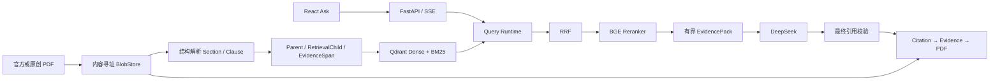

# 架构与职责

CiteWeave 使用 React + TypeScript 工作台和 FastAPI API。v0.1 单轮查询通过 SSE 返回草稿及最终结果，v0.2a 会话 UI 读取持久 Run/result（其 SSE endpoint 仅为有限快照）；文档摄取交给异步 worker。前端类型由 Pydantic / OpenAPI 生成。

```mermaid
flowchart LR
    PDF[官方或原创 PDF] --> Blob[内容寻址 BlobStore]
    Blob --> Parse[结构解析 Section / Clause]
    Parse --> Parent[Parent / RetrievalChild / EvidenceSpan]
    Parent --> Index[Qdrant Dense + BM25]
    Ask[React Ask] --> API[FastAPI / SSE]
    API --> Query[Query Runtime]
    Index --> Query
    Query --> RRF[RRF]
    RRF --> BGE[BGE Reranker]
    BGE --> Pack[有界 EvidencePack]
    Pack --> Model[DeepSeek]
    Model --> Validate[最终引用校验]
    Validate --> View[Citation → Evidence → PDF]
    Blob --> View
```

## 数据归属

| 组件 | 责任 | 边界 |
| --- | --- | --- |
| PostgreSQL | 文档版本、Run / Job、状态与期限、执行记录、持久化元数据 | 不作为向量召回引擎 |
| Qdrant | 带类型与版本约束的可重建 Dense / BM25 检索索引 | 不作为业务生命周期的唯一真相或 PDF 备份 |
| Redis | Celery 任务通知传输 | 未验证为通用生产缓存 |
| Celery | 异步解析、编码、写索引；业务状态回写 PostgreSQL | 未验证为通用生产评测 worker |
| LocalBlobStore | 不可变原始 PDF 与 canonical artifacts | 未部署云对象存储 |

查询以 Child 召回，使用 E5-small 编码、BM25 与 RRF（k=60）融合，再由 bge-reranker-v2-m3 精排。Parent 扩展保留来源，并受证据数量与 token 预算约束。EvidencePack 将 seed、heading、sibling 等来源关联到原始 span。最终引用指向 EvidenceSpan 身份，不是临时检索排名。

文档、版本、解析器及来源哈希固定后才能绑定可检查的证据。PDF.js 使用保存的页码与几何位置高亮原始文件。结构页不通过临时重新解析覆盖已有证据；旧 Run 保留原 profile 与来源身份。

## 任务与查询

摄取任务先持久化，再经 Redis 通知 Celery；worker 的状态转换和索引发布受持久状态约束。索引只在 READY 提交后对查询开放。重试、取消、超时与不确定提供商结果有显式记录；实现中存在保护不等于每种生产故障均经过验证。

当前产品验证覆盖真实检索、DeepSeek 问答、引用到 PDF 和独立样本的异步摄取成功路径。评测调度和恢复的实现可供阅读，但不能由摄取测试推出生产评测 consumer 已验证。

## 实现入口

### 当前增量：#5c-1 Durable Provider Ledger / Recovery

在 accepted main `3502981`（#5b）上，Product Owner 单独批准的 #5c-1 只实现 provider 账本与恢复基础设施；Human Implementation Review pending。此前各节描述对应增量当时的边界，本节为当前计量/恢复状态。**#5c-2 runtime 接线与 #5d 均 NOT_STARTED；默认生产 runtime 不可用，production history 仍 fail-closed。**

Alembic `0010` 为既有 `cw4_provider_phases` 增加 nullable Conversation Run 外键、provider/model/price revision、单次调用授权 ID/期限/input-output caps、prompt revision 和 request hash。复用原 phase/attempt、owner/fence、reservation、usage/cost/result identity；不新增账本、不伪造 QueryRun，也不在 `cw5_runs` 重复存调用计量。条件约束禁止 Conversation 与 QueryRun/Eval 混合归属，保留旧 Eval+Query 合法组合；每 Run/purpose 一个 phase，授权 ID 唯一，数据库 trigger 阻止身份/价格/授权追溯修改。

`conversation_provider.py` 在短事务中先锁 Conversation，校验 workspace/scope/head/owner/fence/PG deadline，再写 phase；flush 后再验期限。PREPARED 与 DISPATCHED 分开，后者必须先 commit 才可能由未来 runtime 发出外部请求；重复 dispatch 明确失败。当前模块没有 transport/runtime 调用。成功/不确定观察保留 provider usage、request ID、result hash；缺值不补造。费用复用 `costs.py` 的固定 revision 和 dispatch 时间，只是估计，非实扣账单；单次显式授权不替代后续累计预算策略。

过期 ADMITTED 无可能执行的 provider 派发时进入 INTERRUPTED；直接观测到的确定未执行拒绝同样可安全恢复。DISPATCHED/UNKNOWN 或已有 provider 响应但尚无 Acceptance 时保守进入 UNKNOWN，禁止普通 retry；已 ACCEPTED 不被 reconciliation 改写。未决 phase 不能被接受或隐藏成可重试失败，同 Run 后续 phase 也不能继续派发。既有来源/Citation/head/fence 原子接受不弱化，无自动重发、后台恢复或 provider-specific reconciliation。详见 [ADR 0011](adr/0011-conversation-provider-ledger.md)。

验证使用 UUID 隔离 PG、原创 synthetic receipts 和 mocked transport，旧 Query/Eval 回归保持有效；实际计数见 [HANDOFF](../HANDOFF.md)。没有迁移配置中的应用 DB，没有启动服务/修改 Qdrant 或 RAGFlow。**provider/model/Judge calls = 0；monetary exposure = 0 CNY；REAL_QDRANT NOT_VERIFIED；DEV/HARD/REG NOT_RUN；public API/React、retrieval/ranking/EvidencePack 语义不变；v0.2a NOT_COMPLETE。**

### v0.2a 内部 Conversation Core（Implementation #1）

独立授权的持久核心已实现；公开 API 接线见 Implementation #5a，React 会话 UI 见 #5b，真实模型会话执行未开放。PostgreSQL `cw5_conversations / cw5_turns / cw5_runs / cw5_acceptances` 保存会话、不可变原始请求、相关执行尝试和不可变接受记录；v0.1 QueryRun、单轮问答、摄取和证据 reader 不改变。

`conversations.py` 在短事务中锁定 Conversation，检查 workspace/显式 KB 与版本范围、幂等 fingerprint、expected head 和单活动执行。部分唯一索引限制活动 Run；单调 fence、owner 和显式 deadline 阻止迟到接受。同 key 同请求读回原身份，异内容冲突；独立请求 busy/head conflict，不排队或 rebase。显式 retry 保留原 Turn、产生新 Run；UNKNOWN 不重发。

接受记录将已产出的控制结果与仅含来源 Turn/前驱的最小状态快照存为一个 bundle；其 ID 同时是 result/state/head 身份。插入 bundle、推进 head、关闭 Run、释放活动槽在一个事务内完成。最初仅接受 clarification/evidence-insufficient 控制结果；Working State 扩展见 Implementation #2，内部澄清策略见 Implementation #3，documentary answer/Citation 接入见 Implementation #4。读回只判断 PG 真相，显式过期 reconciliation 最多处理一个活动 Run，没有自动续算。

Alembic `0009` 仅增加表/约束，不改写历史迁移或 v0.1 数据；不提供破坏性 downgrade。理由、替代方案和恢复边界见 [ADR 0010 implementation record](adr/0010-conversation-core-storage.md)。离线验证已通过；既有 PostgreSQL 18.1 的独立 UUID 测试库完成 12 项真实 PG 测试，覆盖迁移/旧 reader、并发/幂等/fencing、原子可见性、回滚和回执丢失读回。应用数据库未迁移，实际应用数据兼容性和 backup restore **未验证**，当前计数见 [HANDOFF](../HANDOFF.md)。这不代表 v0.2a 完成或可启动 provider。

### v0.2a Relevant History / Working State（Implementation #2）

`conversation_contract.py` 定义内部 resolved signals / delta / non-Evidence Working State；`conversation_history.py` 实现纯确定性 reducer、完整来源组与选择；`conversation_history_pg.py` 负责 PostgreSQL 读取及有界准入。没有 NLP、关键词/向量检索或模型执行。A 为最近 N=2 个 committed accepted Turns；B 按显式来源、同 task 的 entity+适用约束、task、topic 精确匹配全会话元数据。A 不凭近期性自动入选；任何来源仍须通过当前授权与 scope。

关系按完整连通组展开，精确 Acceptance/Turn 身份去重，保留 correction/dependency 边、原始 request 与 UTF-8 hash；同文异版不合并。优先 mandatory/explicit、correction、entity+constraints、task、topic，同层按稳定来源 ID。每分支最多8组，union C=8、最终 K=2；N/C/K 均为保守实现默认，非测量最优。mandatory 超限、缺失来源或纠正链不完整均显式失败，不裁组；内部结果保留 origins/reasons、union、rejections、cutoff/search_incomplete，可供后续 Trace 使用。

`conversation-state-v2` 在原 acceptance JSONB 中保存 topic/entity/constraint/ambiguity 条目、当前 scope、输入 delta 与前驱身份。每条语义值带 accepted Turn/Acceptance 来源、原 scope、active 状态与后续变更来源。纠正可明确指定整来源或 state item IDs；未纠正项继续继承，已停用项不会因 scope 扩大复活。历史 Turn 的元数据遇到任一纠正后不自动作为活跃 B 匹配；仍可由显式引用/已验证 state 来源恢复完整组。scope 收窄使不适用条目失效，旧快照不修改。持久快照不截断，读取投影最多16项；每组最多8原文成员。Memory 类型不能作为 documentary Evidence。

`accept(..., delta=...)` 在现有锁定事务中验证 delta 的前驱、来源与当前 scope，再由 reducer 产生带本次 Acceptance 身份的快照；result/state/head/Run 保持原子发布。v1 原有记录可读，后续可接受 v2；v2 后禁止 legacy finalize 静默清空状态。未增加迁移、表或新 ADR，沿用 ADR 0007/0008/0010 的职责与 JSON 演进空间。

真实 history query 默认 disabled：协议中的生产扫描/期限绑定仍 DEFERRED。显式 `LocalHistoryRead` 仅开放隔离 UUID 测试库，整库最多512个 acceptance/Turn、1024个 Run，statement timeout 1000ms；这是 L1 资源界，不是产品容量。SQL 候选阶段只物化元数据，按完整组限制四个 B 分支，展开全部依赖后先检查64个来源行上限，再在 PG 物化完整原文；128 KiB UTF-8 history body 门禁在返回客户端前检查；加上授权/锁/准入实测6次往返，低于8次上限。任何搜索、成员、投影或期限超限均 fail closed；不通过分页/refetch 绕过。真实测试覆盖跨窗恢复、scope、原子可见性/回滚、重启及边界；计数和未验证范围见 [HANDOFF](../HANDOFF.md)。无公开 API、前端或现有 Evidence RAG 路径变更；Implementation #3 见下节；v0.2a 未完成。

### v0.2a Interpretation / Rewrite / Clarification（Implementation #3）

`conversation_interpretation.py` 消费现有 `HistorySelection` / Working State，以 typed draft 表示 topic continue/shift/return、当前原文 span 或 accepted 来源的 intent facts、指代候选、歧义、rewrite 和纠正。provider-neutral `Interpreter` 只有显式注入 seam 与确定性 fake；无生产 provider runtime、凭据加载、公开 API 或 prompt。

无结构化草稿且无注入 interpreter 时返回 `interpretation_required`，不以代词正则/关键词判定自足性。草稿明确无依赖且无继承项时 USE_ORIGINAL；多个有效候选（同一 mention 的重复条目先合并）或 unresolved 意图时 CLARIFY；有依赖且全部来源/结构校验通过才 USE_REWRITE。来源必须在选中的完整组内，同会话、当前 scope、精确 Acceptance/Turn；state 来源须匹配当前 active 投影。部分纠正只能绑定明确仍活跃的 item，不能复活已纠正假设。

改写保守限定为完整原问加有来源的补全值，分别保留 original/proposed/selected query；scope 完全一致，显式 critical entity/document/version/time/negation/constraint 项保持。任意自由增删、缺源、范围扩大均失败，不静默改用不安全原文。typed result 返回事实来源、绑定、topic、歧义、结构 guard 结果与 delta hash，供后续 Trace 使用；不保存思维链。**结构校验不能证明自然语言语义保真，Memory 不能证明文档事实**。语义 skip、候选完整性、改写质量仍需后续评测/人审。

复用 `ResolvedConversationDelta` 与现有 reducer。shift 停用旧上下文，return 重验旧来源并停用无关活跃条目；v2 delta 的可选 `topic_relation` 标记区分上下文停用与用户纠正，旧记录缺省为 None。混合 correction + shift/return 草稿明确拒绝，避免将纠正标为可恢复停用。未增加迁移/表/依赖或改变 A/B 选择；旧 v1/v2 可读。澄清仅生成 unresolved ambiguity state，丢弃猜测的 resolved mutations；后续结构化回复可清除歧义。

`accept(..., interpretation=(input, draft))` 在现有事务内再次匹配 durable Turn/head/来源内容/ACCEPTED Run 状态，并重算结果/delta；复用 scope、owner、fence、deadline 和 reducer，原子提交控制结果、状态、head、终态 Run。来源校验是有界精确 ID 读取，不另建 history 搜索。允许已有 externally-produced evidence-insufficient control 承载确认后的 state；解释层自身不执行 Evidence RAG；其后接线及 documentary answer 接受见 Implementation #4。37 个解释离线用例和 8 个新增真实 PG 用例通过；全量及局限见 HANDOFF。生产 history query 仍 fail-closed；完整 durable interpretation Trace 与模型计量未实现；Context Assembler 见 Implementation #4，公开 API 的有限持久字段投影见 #5a，React 会话 UI 见 #5b。

### v0.2a Context Assembler / Evidence RAG（Implementation #4）

`conversation_evidence.py` 提供内部 `GenerationContext` 和 `execute`：admitted Run preflight → 既有 HistorySelection/Working State → Implementation #3 interpretation → 原文/已验证 rewrite → 当前范围的 Evidence RAG → typed assembly → Answer/Citation validation → atomic acceptance。CLARIFY 不检索、不生成文档答案。生产 history read 继续 fail-closed；隔离 L1 显式 permit 是唯一已验证的执行入口。

原问、检索 query、解释元数据、必要完整历史组、活跃且相关的 state 投影、documentary pack 分类型保存。历史只携带原始用户文本和 correction/dependency 来源；不携带历史 assistant answer 或旧 Citation。USE_ORIGINAL 不注入无关历史，已纠正条目不进入活跃投影；Memory 始终只解释意图。完整 pack 不因历史占用而裁剪。显式本地 UTF-8 字节门禁只限制 synthetic 工作量，不替代真实 provider tokenizer/framing/output reserve；超限失败而非伪装证据不足。

`conversation_evidence_pg.py` 复用现有 `capture`、`StructuralRetriever`、Dense/BM25/RRF/BGE、EvidencePack selection 和 `citation_for`，使用当前授权 KB/不可变版本，未改排名、索引、prompt 或选择语义。生成只有显式注入的 provider-neutral seam，测试使用 deterministic fake；空 pack 沿用现有 REFUSAL，不调用生成。原始 v0.1 Ask 和 QueryRun 不变，不为会话伪造提前完成的单轮结果。

`DocumentaryResult` 在现有 acceptance JSON 内保留 Answer/Citation、结构 snapshot、完整 pack 和最小 Trace 身份；无迁移、新表或旧记录改写。提交事务重验来源内容/ACCEPTED Run、scope/版本/document、不可变 build/atom/lineage、pack 文本/标签、当前 Run 和引用身份，再用既有 reducer、head/owner/fence/deadline 检查原子发布 result/state/head/终态 Run/slot。返回 receipt 丢失通过既有 readback 恢复，不自动执行或重试。失败不发布，显式 finish/reconciliation 负责终态处理。

验证标签 `CURRENT_PACK_PHYSICAL_ONLY` 明确只证明引用身份和物理解析，不证明自然语言语义支持。离线、真实隔离 PG + fake retrieval adapters 的实际结果见 HANDOFF；真实 Qdrant、模型答案质量和生产会话能力未验证。另行授权的公开 API 与持久 Trace 投影见 #5a；UI 见另行授权的 #5b；完整 Trace 重建、provider accounting/admission 仍待后续授权，v0.2a NOT_COMPLETE。

### v0.2a Public Conversational API / Durable Trace（Implementation #5a）

`conversation_api.py` 复用现有 `/v1`、Bearer/session workspace 授权、错误 envelope 和 no-store 响应；`conversation_public.py` 只定义版本化 allowlist 投影，不另建会话真相。Pydantic/OpenAPI 是类型来源，`contracts/openapi.json`、`apps/web/openapi.json` 和生成的 TypeScript 同步更新。旧路径与 schema 保持不变。#5a 无新表/迁移或测试专用 HTTP endpoint，React 会话组件见 #5b。

| 方法 / 路径 | 契约 |
| --- | --- |
| POST `/v1/conversations` | `Idempotency-Key` 创建或返回同 workspace 会话，200；无请求体 |
| GET `/v1/conversations/{conversation_id}` | 当前 head、active Turn/Run 身份；不包含历史内容 |
| POST `/v1/conversations/{conversation_id}/turns` | `Idempotency-Key` + `{question, scope: {kb_id, version_ids}, expected_head}`；expected_head 必填，初始为 null；返回稳定 Conversation/Turn/Run 身份与状态 |
| GET `/v1/conversations/{conversation_id}/runs/{run_id}` | 该 Run 的持久状态及其 accepted bundle（如有）；不触发执行 |
| GET `…/runs/{run_id}/result` | 该 Run 已原子接受的结果；尚无结果返回 409 `conversation_result_unavailable` |
| GET `…/runs/{run_id}/trace` | `conversation-trace-v1`，已持久化的结构化身份/结果描述 |
| GET `…/runs/{run_id}/events` | `text/event-stream`，有限 durable snapshot，不订阅未来阶段 |

Turn DTO 直接转换为 Core Admission，复用原 scope 规范化与 fingerprint；不清理/截断原问。Core `admit_once` 在既有事务内区分首次准入/幂等重放，相同 key+请求返回原身份，改变请求、过期 head 或第二活动 Turn 为 409；授权/scope/跨会话访问按既有 404 边界处理。新的 `read_run_id` 复用原授权读回事务；不新增 route 层并发规则。服务器执行 owner/deadline 不接受客户端输入。

默认 `UnavailableRuntime` 对新授权提交返回 503 `conversation_runtime_unavailable`，事务不创建 Turn/Run；生产 history query 仍 DEFERRED/fail-closed。显式注入的 provider-neutral runtime 只有 `prepare`（锁内本地、无副作用的执行身份/期限供应）与 `execute`（准入 commit 后调用现有执行/接受边界），没有默认模型、token/time/cost 假设或后台工作架构。测试使用隔离 L1 的确定性 runtime。运行时只有新准入调用一次；重放即使默认 runtime 不可用也可恢复原身份，不重执行。Pending 为 202，终态读回为 200。执行异常返回去敏 503 `conversation_runtime_outcome_unavailable`，不推断 FAILED/UNKNOWN、不自动重发：重放 key/Run readback 恢复 durable truth；现有显式 finish/reconciliation 负责失联后的 lifecycle。

结果为 `conversation-result-v1` discriminated union：clarification、evidence_insufficient、documentary_answer。文档答案只输出当前 accepted text、已有 Citation（exact span、版本、PDF locator/content URL）与 snapshot 中 document/version 绑定；不输出内部 Answer 的 prompt/usage/provider 信息。failed/old attempt 即使同一 Turn 后续 retry 成功，也不将后者标为前者的结果；head 与 attempt 是不同身份。

Trace 公开原问、scope、Conversation/Turn/Run/retry、输入 head、accepted/output-state bundle ID、状态和已存时间；documentary bundle 额外公开已存解释 mode/hash/selected query、History SourceRef、输入 state item ID、retrieval profile、document/version、pack hash、Evidence/Citation 身份与物理验证结果。无历史原文、state 值、隐藏思维链、私有 prompt、原始 provider payload、凭据或另一个 workspace 的内容。所有字段从已授权 durable readback 投影，不重新解释/检索。控制 bundle 的解释/检索字段为 null（`metadata_availability=control_bundle`）；未接受为 `no_accepted_bundle`。这些缺失并不表示没有尝试过该阶段。失败类别/完整解释输入/阶段计量未持久化则不补造，不为有限 Trace 改 schema。`CURRENT_PACK_PHYSICAL_ONLY` 不证明 semantic entailment，`semantic_support=NOT_ASSESSED`。

SSE 复用 `data: <JSON>\n\n`，`conversation-event-v1` 封装 lifecycle（Run snapshot）和存在时的 result（accepted bundle）。一次 GET 读取同一授权快照，发出一或两条事件后关闭；无 provisional draft、订阅/重放日志或 Last-Event-ID 保证。断线不取消执行；用 Run/result 或再次 GET events 重连读回。PG commit 前没有 final/partial documentary Trace 可见，HTTP reader 沿用 Core 锁得到一致结果。

实际隔离 PG、API、v0.1/#1–#4 回归与生成类型检查见 [HANDOFF](../HANDOFF.md)。**provider/model/Judge calls = 0；DEV/HARD/REG NOT_RUN；REAL_QDRANT NOT_VERIFIED；real provider/accounting、#5c NOT_STARTED；v0.2a NOT_COMPLETE。** 本增量不改变检索/ranking/prompt/EvidencePack/offsets，也不声称真实会话 runtime 已可用。另行授权的 React 会话 UI 见下节。

### v0.2a React Conversational Product Surface（Implementation #5b）

`workspace.tsx` 在现有知识库 Ask 工作台中提供会话/单轮选择；旧 `?run=` reader 继续走单轮路径。复用文档上传/选择、生成 API 类型、现有 Button、Citation token 解析和 `PdfEvidence`。`conversation-panel.tsx` 显式显示下一 Turn 的文档版本范围、原始问题、持久 Run 状态和三种已接受结果。clarification 可在下一 Turn 自然回复，evidence_insufficient 不显示文档引用；documentary_answer 的 Citation 绑定其自身不可变版本、exact span 和 content URL。切换范围/追问不会把旧引用重定向到新文档；物理定位语义不变。

`conversation-session.ts` 管理请求与读回，不成为第二套会话真相。每个有意 create/submit 先保存稳定 key，再发送；sessionStorage 仅保存本标签页当前 Conversation/已知 Run 身份、明确选择的版本和未确认请求（原问题/scope/expected_head/key）。结果和当前 head 每次由公开 Conversation/Run/Trace GET 获取；提交成功后也重新读取 head。无 mount/effect 自动提交；同步操作锁避免双击/StrictMode 重复发送。网络丢失/503 保留同 key 同 body，先读回，再由用户显式恢复；已有 Run 只读回，不重 dispatch。409 刷新状态，下一次提交须新的有意操作，不自动 rebase。存储写失败阻止发送；授权读回失败时移除可使用的缓存结果/head。

ADMITTED 只表示后端已准入，UI 不猜测检索/生成阶段，也不把 HTTP 503 当作 FAILED。每次进入 pending 观察期最多三次自动 GET（空闲时相隔三秒），之后手动刷新；终态按后端 ACCEPTED/FAILED/CANCELLED/INTERRUPTED/UNKNOWN/STALE 展示。`/events` 仍是有限持久快照，本 UI 使用 GET 读回，不引入 token streaming、Last-Event-ID、订阅、事件日志或断线取消。当前 API 没有历史枚举；刷新只恢复本标签页已知 Run，不能恢复其他浏览器的完整历史。新会话不删除原有服务端记录。

Trace Inspector 是答案后的次级 disclosure，只显示 conversation-trace-v1 已公开的身份、原问/scope、状态/时间、解释模式、选定 query、文档/版本及 Evidence/Citation/validation 等字段。null 显示“未记录 / 不可用”，不推导 CLARIFY、阶段耗时、失败原因或费用。`CURRENT_PACK_PHYSICAL_ONLY ≠ semantic support`，语义评估保持 `NOT_ASSESSED`。

浏览器验收由 opt-in `tests/test_conversation_browser.py` 启动，Playwright 配置只接受该 harness 的本地 URL。它在现有 PostgreSQL 上创建/迁移/删除自己的 UUID 隔离库，生成原创单页 PDF 和对应 source hash，使用生产 web build、原有鉴权/公开 endpoint 和服务端 `ConversationalRuntime` seam。fake model/retrieval/generator 调用 #4 编排，LocalHistoryRead permit 仅存在于隔离测试中；Python 外发 HTTP adapter 被测试拦截。另起一个未注入 runtime 的应用验证默认 503/no-admission。没有新增测试 HTTP endpoint、生产配置开关或 React canned results。Chromium 覆盖三类结果、引用/PDF 高亮、accepted head、Trace、刷新、回执丢失同键恢复、键盘操作与小窗；PG 额外检查 Turn/Run/Acceptance 基数。命令、实际计数及 synthetic 限制见 [HANDOFF](../HANDOFF.md)。现有双平台离线 CI 不替代这次本地真实 PG/browser 证据。

**生产会话 runtime 仍不可用，production history query 仍 DEFERRED/fail-closed；provider/model/Judge calls = 0。#5c 仍需另行授权，尚未开始；完整 Trace 重建/计量、真实语义质量与生产执行准入未完成，v0.2a NOT_COMPLETE。** #5b 不改变任何后端生产源码、durable schema、检索/Evidence/offset 契约。

### 现有产品路径

- `src/citeweave/api.py`、`answering.py`、`query_runtime.py`：API、SSE 与 Run。
- `structure.py`、`structural_ingestion.py`：结构解析与摄取。
- `structural_retrieval.py`、`evidence_selection.py`、`query_evidence.py`：混合检索与 EvidencePack。
- `domain.py`、`ingestion_state.py`、`worker_runtime.py`：持久模型与任务。
- `apps/web/src/workspace.tsx`、`pdf-evidence.tsx`、`structural-trace.tsx`：问答、PDF 与检索记录。

细节 ADR 保留了实现时期的契约名称，仅用于理解工程约束。最新运行与验证范围以本页、README 和 QUICKSTART 为准。
