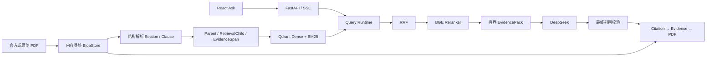

# 架构与职责

CiteWeave 使用 React + TypeScript 工作台和 FastAPI API。同步查询通过 SSE 返回草稿及最终结果；文档摄取交给异步 worker。前端类型由 Pydantic / OpenAPI 生成。

```mermaid
flowchart LR
    PDF[官方或原创 PDF] --> Blob[内容寻址 BlobStore]
    Blob --> Parse[结构解析 Section / Clause]
    Parse --> Parent[Parent / RetrievalChild / EvidenceSpan]
    Parent --> Index[Qdrant Dense + BM25]
    Ask[React Ask] --> API[FastAPI / SSE]
    API --> Query[Query Runtime]
    Index --> Query
    Query --> RRF[RRF]
    RRF --> BGE[BGE Reranker]
    BGE --> Pack[有界 EvidencePack]
    Pack --> Model[DeepSeek]
    Model --> Validate[最终引用校验]
    Validate --> View[Citation → Evidence → PDF]
    Blob --> View
```

## 数据归属

| 组件 | 责任 | 边界 |
| --- | --- | --- |
| PostgreSQL | 文档版本、Run / Job、状态与期限、执行记录、持久化元数据 | 不作为向量召回引擎 |
| Qdrant | 带类型与版本约束的可重建 Dense / BM25 检索索引 | 不作为业务生命周期的唯一真相或 PDF 备份 |
| Redis | Celery 任务通知传输 | 未验证为通用生产缓存 |
| Celery | 异步解析、编码、写索引；业务状态回写 PostgreSQL | 未验证为通用生产评测 worker |
| LocalBlobStore | 不可变原始 PDF 与 canonical artifacts | 未部署云对象存储 |

查询以 Child 召回，使用 E5-small 编码、BM25 与 RRF（k=60）融合，再由 bge-reranker-v2-m3 精排。Parent 扩展保留来源，并受证据数量与 token 预算约束。EvidencePack 将 seed、heading、sibling 等来源关联到原始 span。最终引用指向 EvidenceSpan 身份，不是临时检索排名。

文档、版本、解析器及来源哈希固定后才能绑定可检查的证据。PDF.js 使用保存的页码与几何位置高亮原始文件。结构页不通过临时重新解析覆盖已有证据；旧 Run 保留原 profile 与来源身份。

## 任务与查询

摄取任务先持久化，再经 Redis 通知 Celery；worker 的状态转换和索引发布受持久状态约束。索引只在 READY 提交后对查询开放。重试、取消、超时与不确定提供商结果有显式记录；实现中存在保护不等于每种生产故障均经过验证。

当前产品验证覆盖真实检索、DeepSeek 问答、引用到 PDF 和独立样本的异步摄取成功路径。评测调度和恢复的实现可供阅读，但不能由摄取测试推出生产评测 consumer 已验证。

## 实现入口

### v0.2a 内部 Conversation Core（Implementation #1）

独立授权的持久核心已实现，尚未接入公开 API/UI 或模型执行。PostgreSQL `cw5_conversations / cw5_turns / cw5_runs / cw5_acceptances` 保存会话、不可变原始请求、相关执行尝试和不可变接受记录；v0.1 QueryRun、单轮问答、摄取和证据 reader 不改变。

`conversations.py` 在短事务中锁定 Conversation，检查 workspace/显式 KB 与版本范围、幂等 fingerprint、expected head 和单活动执行。部分唯一索引限制活动 Run；单调 fence、owner 和显式 deadline 阻止迟到接受。同 key 同请求读回原身份，异内容冲突；独立请求 busy/head conflict，不排队或 rebase。显式 retry 保留原 Turn、产生新 Run；UNKNOWN 不重发。

接受记录将已产出的控制结果与仅含来源 Turn/前驱的最小状态快照存为一个 bundle；其 ID 同时是 result/state/head 身份。插入 bundle、推进 head、关闭 Run、释放活动槽在一个事务内完成。当前只接受预先校验的 clarification/evidence-insufficient 文本，拒绝 documentary answer；Working State 扩展见 Implementation #2，内部澄清策略见 Implementation #3，仍无 Citation 接入。读回只判断 PG 真相，显式过期 reconciliation 最多处理一个活动 Run，没有自动续算。

Alembic `0009` 仅增加表/约束，不改写历史迁移或 v0.1 数据；不提供破坏性 downgrade。理由、替代方案和恢复边界见 [ADR 0010 implementation record](adr/0010-conversation-core-storage.md)。离线验证已通过；既有 PostgreSQL 18.1 的独立 UUID 测试库完成 12 项真实 PG 测试，覆盖迁移/旧 reader、并发/幂等/fencing、原子可见性、回滚和回执丢失读回。应用数据库未迁移，实际应用数据兼容性和 backup restore **未验证**，当前计数见 [HANDOFF](../HANDOFF.md)。这不代表 v0.2a 完成或可启动 provider。

### v0.2a Relevant History / Working State（Implementation #2）

`conversation_contract.py` 定义内部 resolved signals / delta / non-Evidence Working State；`conversation_history.py` 实现纯确定性 reducer、完整来源组与选择；`conversation_history_pg.py` 负责 PostgreSQL 读取及有界准入。没有 NLP、关键词/向量检索或模型执行。A 为最近 N=2 个 committed accepted Turns；B 按显式来源、同 task 的 entity+适用约束、task、topic 精确匹配全会话元数据。A 不凭近期性自动入选；任何来源仍须通过当前授权与 scope。

关系按完整连通组展开，精确 Acceptance/Turn 身份去重，保留 correction/dependency 边、原始 request 与 UTF-8 hash；同文异版不合并。优先 mandatory/explicit、correction、entity+constraints、task、topic，同层按稳定来源 ID。每分支最多8组，union C=8、最终 K=2；N/C/K 均为保守实现默认，非测量最优。mandatory 超限、缺失来源或纠正链不完整均显式失败，不裁组；内部结果保留 origins/reasons、union、rejections、cutoff/search_incomplete，可供后续 Trace 使用。

`conversation-state-v2` 在原 acceptance JSONB 中保存 topic/entity/constraint/ambiguity 条目、当前 scope、输入 delta 与前驱身份。每条语义值带 accepted Turn/Acceptance 来源、原 scope、active 状态与后续变更来源。纠正可明确指定整来源或 state item IDs；未纠正项继续继承，已停用项不会因 scope 扩大复活。历史 Turn 的元数据遇到任一纠正后不自动作为活跃 B 匹配；仍可由显式引用/已验证 state 来源恢复完整组。scope 收窄使不适用条目失效，旧快照不修改。持久快照不截断，读取投影最多16项；每组最多8原文成员。Memory 类型不能作为 documentary Evidence。

`accept(..., delta=...)` 在现有锁定事务中验证 delta 的前驱、来源与当前 scope，再由 reducer 产生带本次 Acceptance 身份的快照；result/state/head/Run 保持原子发布。v1 原有记录可读，后续可接受 v2；v2 后禁止 legacy finalize 静默清空状态。未增加迁移、表或新 ADR，沿用 ADR 0007/0008/0010 的职责与 JSON 演进空间。

真实 history query 默认 disabled：协议中的生产扫描/期限绑定仍 DEFERRED。显式 `LocalHistoryRead` 仅开放隔离 UUID 测试库，整库最多512个 acceptance/Turn、1024个 Run，statement timeout 1000ms；这是 L1 资源界，不是产品容量。SQL 候选阶段只物化元数据，按完整组限制四个 B 分支，展开全部依赖后先检查64个来源行上限，再在 PG 物化完整原文；128 KiB UTF-8 history body 门禁在返回客户端前检查；加上授权/锁/准入实测6次往返，低于8次上限。任何搜索、成员、投影或期限超限均 fail closed；不通过分页/refetch 绕过。真实测试覆盖跨窗恢复、scope、原子可见性/回滚、重启及边界；计数和未验证范围见 [HANDOFF](../HANDOFF.md)。无公开 API、前端或现有 Evidence RAG 路径变更；Implementation #3 见下节；v0.2a 未完成。

### v0.2a Interpretation / Rewrite / Clarification（Implementation #3）

`conversation_interpretation.py` 消费现有 `HistorySelection` / Working State，以 typed draft 表示 topic continue/shift/return、当前原文 span 或 accepted 来源的 intent facts、指代候选、歧义、rewrite 和纠正。provider-neutral `Interpreter` 只有显式注入 seam 与确定性 fake；无生产 provider runtime、凭据加载、公开 API 或 prompt。

无结构化草稿且无注入 interpreter 时返回 `interpretation_required`，不以代词正则/关键词判定自足性。草稿明确无依赖且无继承项时 USE_ORIGINAL；多个有效候选（同一 mention 的重复条目先合并）或 unresolved 意图时 CLARIFY；有依赖且全部来源/结构校验通过才 USE_REWRITE。来源必须在选中的完整组内，同会话、当前 scope、精确 Acceptance/Turn；state 来源须匹配当前 active 投影。部分纠正只能绑定明确仍活跃的 item，不能复活已纠正假设。

改写保守限定为完整原问加有来源的补全值，分别保留 original/proposed/selected query；scope 完全一致，显式 critical entity/document/version/time/negation/constraint 项保持。任意自由增删、缺源、范围扩大均失败，不静默改用不安全原文。typed result 返回事实来源、绑定、topic、歧义、结构 guard 结果与 delta hash，供后续 Trace 使用；不保存思维链。**结构校验不能证明自然语言语义保真，Memory 不能证明文档事实**。语义 skip、候选完整性、改写质量仍需后续评测/人审。

复用 `ResolvedConversationDelta` 与现有 reducer。shift 停用旧上下文，return 重验旧来源并停用无关活跃条目；v2 delta 的可选 `topic_relation` 标记区分上下文停用与用户纠正，旧记录缺省为 None。混合 correction + shift/return 草稿明确拒绝，避免将纠正标为可恢复停用。未增加迁移/表/依赖或改变 A/B 选择；旧 v1/v2 可读。澄清仅生成 unresolved ambiguity state，丢弃猜测的 resolved mutations；后续结构化回复可清除歧义。

`accept(..., interpretation=(input, draft))` 在现有事务内再次匹配 durable Turn/head/来源内容/ACCEPTED Run 状态，并重算结果/delta；复用 scope、owner、fence、deadline 和 reducer，原子提交控制结果、状态、head、终态 Run。来源校验是有界精确 ID 读取，不另建 history 搜索。允许已有 externally-produced evidence-insufficient control 承载确认后的 state；本层不执行 Evidence RAG 或接受 documentary answer。37 个解释离线用例和 8 个新增真实 PG 用例通过；全量及局限见 HANDOFF。生产 history query 仍 fail-closed；完整 durable interpretation Trace、Context Assembler、模型计量与公开 UI/API 未实现，Implementation #4 NOT_STARTED。

### 现有产品路径

- `src/citeweave/api.py`、`answering.py`、`query_runtime.py`：API、SSE 与 Run。
- `structure.py`、`structural_ingestion.py`：结构解析与摄取。
- `structural_retrieval.py`、`evidence_selection.py`、`query_evidence.py`：混合检索与 EvidencePack。
- `domain.py`、`ingestion_state.py`、`worker_runtime.py`：持久模型与任务。
- `apps/web/src/workspace.tsx`、`pdf-evidence.tsx`、`structural-trace.tsx`：问答、PDF 与检索记录。

细节 ADR 保留了实现时期的契约名称，仅用于理解工程约束。最新运行与验证范围以本页、README 和 QUICKSTART 为准。
