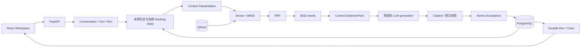
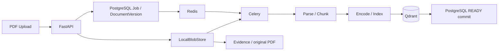

# 架构与职责

本页描述 `main` 的当前实现。最新正式发布为 `v0.2.0`；发布后的改进尚未形成新版本。API 与包元数据保持 `0.2.0`。安装见[快速开始](QUICKSTART.md)，路由与类型见[API](API.md)。

## 查询与会话

```mermaid
flowchart LR
    UI[React Workspace] --> API[FastAPI]
    API --> Run[Conversation / Turn / Run]
    Run --> History[有界历史与有效 Working State]
    History --> Context[Context Interpretation]
    Context --> Retrieval[Dense + BM25]
    QD[(Qdrant)] --> Retrieval
    Retrieval --> RRF[RRF]
    RRF --> BGE[BGE rerank]
    BGE --> Pack[Current EvidencePack]
    Pack --> Model[授权的 LLM generation]
    Model --> Validate[Citation / 原文校验]
    Validate --> Accept[Atomic Acceptance]
    Accept --> PG[(PostgreSQL)]
    PG --> Trace[Durable Run / Trace]
    Trace --> UI
    PG --> History
```

React 19 / TypeScript / Vite / Router / TanStack Query 工作台通过 Pydantic/OpenAPI 生成的类型访问 FastAPI。SQLAlchemy 2 管理 Session 与事务；Alembic 管理持久 schema。

Conversation 保存 workspace、固定文档范围及已接受 head；Turn 保存不可变原始请求；Run 表示执行尝试。客户端使用稳定 `Idempotency-Key`，重复请求恢复同一身份。Acceptance 在一笔事务中发布结果、下一轮状态、Conversation head 与 Run 终态。对外结果有 `documentary_answer`、`clarification`、`evidence_insufficient` 三种，不把草稿作为最终答案。

会话 SSE 是一次有界持久快照；UI 通过 Run/result GET 读回恢复状态。旧单轮查询 API 的 SSE 仍区分 provisional delta 与校验后的 final；流已返回 HTTP 200 并不保证后续生成成功。

### History、State 与当前 Evidence

生产历史读取仅投影已接受身份、原始请求、scope、关系与版本化 State，不把旧 answer、Citation、EvidencePack 或 PDF geometry 带入解释输入。完整持久结果仍保留，投影不截断问题或改写已接受记录。

近期分支与匹配分支提供有界待检查来源；解释模型显式声明 Relevant History，再由应用验证精确 Acceptance/Turn 身份、完整纠正关系、scope、State 来源和继承事实。Recent History 的候选资格不等于相关性；候选中的未选来源也不自动进入生成。当前没有公开的数值历史权重。

指代或省略使用原始问题中的准确 mention 与已授权来源值形成查询；歧义走澄清路径。Working State 只包含实际继承、仍有效且在当前范围内的结构化状态，允许真实为空。较旧来源仍受原有匹配条件与扫描上限约束，未声明无限历史语义召回。

解释之后重新执行当前文档检索。History/State 提供意图，Current Evidence 支持回答，两者使用不同类型与校验边界。无当前引用时发布证据不足结果，并跳过 generation。

### 检索与引用

结构化检索以 RetrievalChild 召回，使用 multilingual-e5-small Dense、BM25 与 RRF 融合，再由 bge-reranker-v2-m3 精排。Parent 扩展保留来源，EvidencePack 受证据数量与 token 预算约束。引用最终绑定 EvidenceSpan 身份和不可变文档版本，不绑定临时排名。

生成结果先校验引用标签，再在 Acceptance 事务内核对授权版本、EvidencePack、原文区间与来源身份。PDF.js 使用已保存的页码与几何位置定位原始 PDF。旧 Run 保留其配置和证据身份，不通过重新解析覆盖旧 span。物理引用校验不独立证明自然语言答案的语义支持。

## 摄取与索引发布

```mermaid
flowchart LR
    Upload[PDF Upload] --> API[FastAPI]
    API --> Blob[LocalBlobStore]
    API --> Job[PostgreSQL Job / DocumentVersion]
    Job --> Redis[Redis]
    Redis --> Worker[Celery]
    Blob --> Worker
    Worker --> Parse[Parse / Chunk]
    Parse --> Encode[Encode / Index]
    Encode --> QD[(Qdrant)]
    QD --> Ready[PostgreSQL READY commit]
    Blob --> View[Evidence / original PDF]
```

逻辑 Document 与不可变 DocumentVersion 分开。摄取 Job 先写入 PostgreSQL，再经 Redis 通知 Celery；worker 解析、分块、编码和写索引，并以持久尝试身份隔离外部写入。只有 durable READY 提交完成后，查询才可使用该版本索引。失效尝试不能发布为当前有效版本。

| 组件 | 责任 |
| --- | --- |
| PostgreSQL | 文档版本、Job、Conversation/Turn/Run、Acceptance、期限、授权计量与持久 Trace；业务权威 |
| Qdrant | 带类型、版本及尝试约束的可重建 Dense/BM25 索引 |
| Redis | 可恢复的 Celery 任务通知传输 |
| Celery | 异步解析、编码、写索引；状态回写 PostgreSQL |
| LocalBlobStore | 内容寻址原始 PDF 与 canonical artifacts |
| 本地 E5/BGE gateway | 编码与精排；独立于计费生成提供商 |

同步 Conversation 查询不使用 Redis/Celery。当前实现使用 LocalBlobStore；没有部署云对象存储。

## 可靠性与并发

持久准入、ProviderPhase 授权计量与执行状态绑定精确请求、owner/fence、head、scope 和绝对期限。安全 retry 有限且要求已知未执行证明；不确定提供商结果保留 UNKNOWN 与预算占用，不自动重派。取消、恢复和完成按事务顺序竞争，过期结果不能越过发布检查。恢复工具显式执行 reconciliation，不调用提供商。

执行允许至少一次，保证有效结果幂等；不声明物理投递恰好一次。取消会阻止失效发布，但不能保证停止上游计算。详见[可靠性](V02B_RUNTIME_RELIABILITY_M1.md)与[可观察性及恢复](V02B_OPERATIONAL_OBSERVABILITY_M2.md)。

Acceptance 将已有 SQLAlchemy Session 传给证据与 Citation 读取，避免同一 Transaction 递归 checkout 耗尽 Connection Pool。知识库、Document 与 DocumentVersion 的只读来源检查使用 PostgreSQL `SELECT … FOR SHARE` 到事务结束，使读者可重叠，同时阻止冲突来源修改；Conversation 与 catalog writer 仍使用独占锁，提交前仍检查 owner/fence/head/deadline。

指定本地合成 HTTP/PostgreSQL 工作量在并发 5 时，p95 由 2824.3 降为 1943.7 ms，成功吞吐由 1.919 升为 2.925 workflow/s。模型、检索和提供商响应是合成的；单独的小型真实 Qdrant 测量使用原创三条数据与合成二维 embedding。完整方法、失败分母、共享主机影响与复现步骤见[并发测量](V02B_CONCURRENCY_PERFORMANCE_M3.md)。这些观测不定义生产容量。

## 检查页面与可用性

- Run/Trace Inspector 从认证、固定版本检查后的持久记录读取生命周期、阶段诊断、可用耗时与安全计量。
- Publication Inspector 显示实际 Acceptance、已发布 State 摘要及当前 Conversation head。后续 head 已前进时，旧 Acceptance 仍保留原身份。
- Context Inspector 将持久查询、使用来源与当前证据和可选观察细节分开。细节仅在本地记录与 durable provider phase 请求／响应哈希、当前 request/scope/head、各源 Acceptance/Admission 及解释指纹一致时展示；缺失或不一致分别标注 `NOT_RECORDED` / `UNVERIFIABLE`，不会推测为空输入。候选分支与近期归属仅来自本地观察，未作为独立持久事实保存。
- Operations 使用有界认证读取及可用的服务探测，展示当时可观察状态；不会进行 LLM 健康调用。检查页面不授予执行权限，也不自动恢复或重派。

默认 Conversation runtime 未配置执行授权。真实生成需要服务器端精确 policy、校验过的官方离线 tokenizer、有限调用/token/CNY/期限额度、本地模型与提供商 Key。配置缺失、过期或身份不符均 fail-closed。`/health/ready` 只表示持久 API 可读与启动迁移完成。

## 实现入口与历史记录

当前实现入口：[`conversation_runtime.py`](../src/citeweave/conversation_runtime.py)、[`history_relevance.py`](../src/citeweave/history_relevance.py)、[`conversation_history_pg.py`](../src/citeweave/conversation_history_pg.py)、[`conversation_evidence.py`](../src/citeweave/conversation_evidence.py)、[`conversations.py`](../src/citeweave/conversations.py)、[`context_inspection.py`](../src/citeweave/context_inspection.py)。

架构取舍与 schema 影响保留在 [ADR 目录](README.md#设计与历史记录)。原本附于本页的历史实施状态、授权和计数已原文移至[架构实现历史记录](history/ARCHITECTURE_IMPLEMENTATION_RECORDS.md)，不作为当前安装或执行权限。
