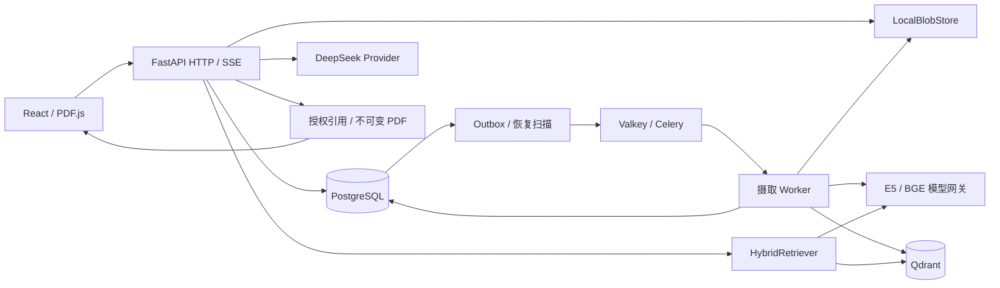

# M1 系统概览 · 0.2 alpha

此文描述已经实现的 M1。早期 `02_架构与技术决策.md` 中的缓存平台、评测治理和 MCP 等仍是路线设计。

## 事实与可重建数据

`domain.py` 保存知识库、逻辑文档、版本、摄取任务、outbox、chunk、query run 和 citation。Alembic 0001 建表，0002 迁入本项目先前创建的 M0 知识库。Document 与 DocumentVersion 分开；重传建立新版本，新版本失败时旧 READY 版本继续可用。

原始 PDF 与派生 block 使用 SHA-256 内容寻址。Chunk ID 由冻结的 evidence 身份规则派生，引用包含 workspace、KB、revision、block、Unicode codepoint offset、quote、页号、归一化字符框和原件哈希。原件、chunk 与引用须在授权范围内重新匹配。

Qdrant 和 Valkey 不承担业务事实。每个任务 fence 写独立 collection；验证 point 数量和完整 ID 集后，在 PG 事务中发布 READY 指针。晚到的旧 worker 可能产生废弃索引，不能改变有效指针。实际语义为 **at-least-once execution + fenced, idempotent effective publication**。

## 检索与生成

查询开始从 PG 捕获最多 10 个有效文档版本。E5 输出 384 维归一化向量；中文 BM25 的词表、IDF 和平均长度固定在各文档版本中。每路召回最多 40，应用层一基排名 RRF k=60 合并，前 20 进入 BGE，选最多 6 个证据。分路分数、排名、RRF、reranker 和最终排名保留于 run；它们不是统一概率。

接口边界为 `Retriever`、`Embedder`、`Reranker`、`LLMProvider`、`BlobStore`；SDK 限于适配器。模型共享 Windows 本地网关，GPU FP16，一次一个推理请求；CPU 回退路径存在，未获得本机性能验收。

DeepSeek 仅收到当前问题和已选文本证据。Prompt 来自 `prompts/answer-v1.txt`，结果保存哈希身份。SSE delta 是 provisional；仅在流完整结束、引用标签存在且原文映射有效时发布 final。错误和中断撤回草稿；“证据不足，无法回答。”允许无引用。精确定位不证明回答的每项语义都受证据支持。

## 有界执行与费用

摄取租约默认 30 秒，约 7.5 秒心跳；恢复扫描每 2 秒，最多 3 次执行，退避最多 30 秒。Celery late ACK、prefetch 1，soft/hard limit 240/270 秒。Redis visibility timeout 300 秒不会成为唯一恢复机制。

查询默认 45 秒总 deadline，同时一个 query。超过 120 秒的遗留 RUNNING 标记 api_interrupted。Provider 只在尚无输出的连接失败、429 或选定 5xx 时最多再试一次；输出后不自动重试。暂不具备完整熔断器和分布式并发治理。

PG 串行预算预留控制月上限（默认 ¥50、只能调低），每次预留 ¥0.10。收到 token usage 才按带日期费率卡估算；失联或 5xx 重试造成费用不确定时保留预留。估算不代表实际扣款，无法计入同一 key 在项目外的开销。

## 关键决策

- [ADR 0001：尝试级索引、应用层 RRF、共享模型服务](adr/0001_m1_isolated_snapshots.md)。保留 M0 排名语义；代价是后续需回收废弃 collection，并治理跨文档长度偏差。
- [ADR 0002：reranker 输入上限 512](adr/0002_model_input_bounds.md)。拒绝溢出，避免静默截断；不挪用 M0 延迟作为 M1 性能。
- [ADR 0003：TypeScript 6.0.3](adr/0003_typescript_compiler_api.md)。TypeScript 7 与当前 OpenAPI 生成器不兼容，统一采用已验证工具链。

单机入口把独立构建的 React 静态文件放到 API 同源服务，业务仍全部走 HTTP；开发时可运行独立 Vite。未来拆出静态托管或模型服务无需重写领域流程。
