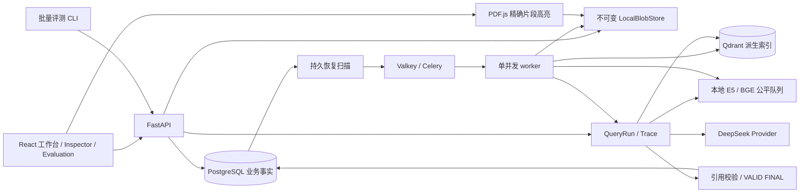

# M2 Production Core 架构

在 M1 Golden Path 上增量演进。API / React 仍完全解耦；没有新增基础设施。API 版本 0.3.0-alpha，默认仍是 Windows 单人单机。

## 事实和派生数据

- Document 保存有效版本指针；Version 的原件、规范文本、chunk、证据身份不被更新覆盖。Qdrant 指针允许 rebuild 后切换，原 citation 始终解析同一个 immutable version。
- QueryRun 是唯一普通请求身份，保存版本 / 物理 collection 快照、候选、阶段、逐次调用、最终结果、usage 和费用。历史 M1 行没有的阶段保持为空，不追造耗时。
- IngestionJob 保留至少一次执行、outbox、租约、fence 和每次尝试独立 collection。增加 `kind=rebuild`；重建成功也不会激活另一个文档版本。
- Index 表登记归属与发布状态，Operation 表保存维护意图和结果。rebuild 的 ACCEPTED 表示已持久接收；最终结果查询其关联 Job。
- EvalRun 保存数据集哈希、split、实际配置和固定版本 / 索引映射；EvalCase 保存持久状态、owner/lease、QueryRun、指标、Judge 与人工复核。没有第二套回答引擎。

## 一次普通回答

创建 QueryRun 时，在 PG 锁下检查预算和单请求限额，并冻结有效版本及索引指针。每个版本分别召回 Dense/BM25 前 40，应用层 RRF k=60 融合，前 20 交给 BGE，选前 6 提供给 answer-v1。M2 保持 M1 排序和切片策略。

Trace 记录 request、query embedding、每版本 dense / sparse、RRF、reranker、evidence selection / binding、LLM、citation validation、final response。JSONB 保存有界摘要，不保存 API key、完整 Prompt 或上游原始错误体。问题和候选文本受单人 workspace 授权保护，仍可能包含用户资料，应按业务数据备份和管理。

流式 delta 是临时草稿。仅引用标签合法、run/version/span 校验通过才提交 final 和 citation membership。精确文本定位不能代替语义蕴含；语义支持在评测中单独判断。

## 持久调度与恢复

摄取优先；评测逐题运行，最多一题 QUEUED/RUNNING。PG 恢复扫描重发过期队列消息，owner 与 lease 拒绝旧执行者写回。普通 Query 的幂等键稳定，已完成只重放，仍在运行则等待；超过恢复窗口的未知调用标失败，不重新付费生成。

Judge 在联系模型前预留费用。若重启后只发现预留而没有结果，标记 unknown，不再次调用。任务取消停止后续题目；已经开始的题目受原 deadline 约束，之后不再启动新 Judge。Valkey 消息丢失不代表业务任务丢失。

## 维护并发边界

快照、发布、GC、回滚共享 PG advisory lock。GC 从 dry-run 开始，实际删除再检查一次。未知归属、所有已发布指针、待执行 / 有效租约、历史 Run / citation 及活跃评测快照都受保护。删除后确认 collection 不存在才记录成功；崩溃后同一 key 重试安全。Blob 不进行 GC。

Rebuild 从 Blob + PG 规范事实恢复，要求 canonical、chunk IDs、文本、坐标、BM25 与原版本一致；模型/解析器变化造成不一致时应新建版本。rollback 使用 expected active version 防止覆盖别人的发布，有正在摄取的新版本时拒绝切换。

## 可靠性与迁移

PG 共享 DeepSeek / model gateway 两个 breaker，closed → open → half-open → closed；半开只放一个有时限的探测，generation 阻止旧结果关闭新熔断状态。Provider 最多 2 次调用（可配置 1–3），只在未开始内容的连接失败、429、指定 5xx 上重试。断流、读超时或内容开始后不自动重新生成。

模型网关一个 GPU 槽，FIFO 最多 4 个等待者，8 个 HTTP handler，排队 8 秒、读取请求 5 秒。查询总 deadline 默认 45 秒，可配置 10–120 秒；Qdrant 单次 8 秒，查询不额外重试，摄取由持久 Job 有限重试。取消关闭上游 HTTP stream；已开始的本地 GPU batch 只能有界完成。

0003 新增治理 / 评测 / breaker 表及 QueryRun 字段，取消版本与 Job 的一对一限制。0004 增加 Judge 实际预约时间用于月预算。M2 数据已产生 rebuild Job 后不应降级运行 M1 应用；业务版本 rollback 与数据库 schema downgrade 是两种不同操作。

设计取舍见 [ADR 0004](adr/0004_m2_production_core.md)，恢复步骤见 [运维指南](M2_OPERATIONS.md)。
