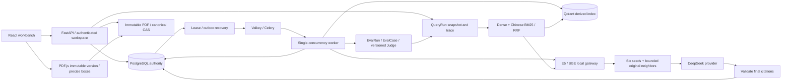

# M3 architecture

Production-oriented evidence RAG for one owner on one Windows machine. API-first FastAPI and React are separated by generated OpenAPI/TypeScript contracts. The selected M3 change extends final evidence context while preserving the indexing and physical-citation contract.

The browser receives provisional SSE text, then a validated final or an error. A generated citation is accepted only when it belongs to the captured run/version and resolves to the exact immutable span. PostgreSQL records effective results; Qdrant collections are isolated per fenced ingestion attempt and become visible only with a durable READY publication. Valkey is a recoverable broker, not the source of truth. Execution is at least once.

Dense uses pinned multilingual-e5-small; BM25 uses the version's frozen Chinese/English analyzer; RRF k=60 combines per-version rankings. Recall remains 40 per branch/version, reranker input 20, BGE reranker v2-m3 selects six seeds. C2 adds same-version/page neighbors within three positions and bounded geometry; at most 30 original spans and 3200 codepoints. Each span keeps its original ID, Unicode offsets and PDF boxes. The selected prompt remains answer-v1. No model replacement or reindexing is needed.

QueryRun captures profile, resolved configuration, prompt hash, immutable versions and physical index bindings. M2 remains explicitly selectable. Context-only spans have an origin seed and no invented retrieval/reranker rank. Inspector exposes Dense, BM25, RRF, actual reranker input, reranked output and final evidence separately. Comparisons require identical dataset/split/rubric; both evaluations are authorized before data is returned.

EvalRun uses the ordinary answer path. Durable EvalCase leases and pre-call cost reservations permit recovery without silently repeating uncertain paid calls. Judge v4 separates exact-refusal policy from LLM-scored factual sentence units. An attached label is structurally valid only for that sentence; semantic support is evaluated separately and can still be wrong. Historical answers/Judges are never overwritten during calibration.

M3 changes no database schema: migrations 0001–0004 still define the durable model. Document version rollback remains distinct from application/schema downgrade. Shared governance locks protect publication, query snapshots, rebuild, rollback and GC. Restoring PG and CAS can rebuild Qdrant while retaining historical citation identities. See [M2 detailed invariants](M2_ARCHITECTURE.md) and [operations](M3_OPERATIONS.md).

Relevant modules: `profiles.py`, `hybrid.py`, `answering.py`, `trace.py`, `evaluation/{service,judge,metrics,reporting,attribution,comparison,human}.py`, `m2_api.py`, and `apps/web/src/operations.tsx`. Design history: [ADR 0005](adr/0005-query-profiles-and-judge-calibration.md).
