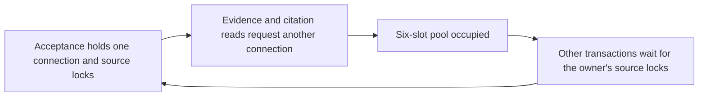

# v0.2b M3 — Conversation concurrency and performance

Status: **V02B_CONCURRENCY_PERFORMANCE_M3_COMPLETE** — provider-free implementation,
measurement and correctness gates complete; Human Implementation Review pending.
The implementation task stopped before delivery. The subsequent Owner-authorized
M3 review/commit/push/PR task is recorded below; merge/auto-merge, tag/release and
the final delivery milestone remain outside its scope.

## Baseline and frozen benchmark contract

Started on clean `codex/v02b-concurrency-performance-m3` at
`8da4d1778a7f88e4d21b43ce5f9ff51426c386e6` (also local main), tree
`6cf4ef113dfa0bb94578b4006de689b45d7d614f`. Alembic has one head, `0014`.
M1/M2 source tests and their ignored receipts were present. The explicit M3 Owner
mission supersedes earlier navigation's stop-before-M3 language without reopening
semantic calibration, live authorization or historical campaigns.

The machine-readable contract is [conversation_contract.json](../benchmarks/conversation_contract.json).
Final contract v2 was frozen before any product optimization at
`2026-10-03T08:35:26.520881Z`;
SHA256 `97e226b7cabb22b170bb1cf5b314d5376f7b509df97676592783b87d54f96ccb`.
The local frozen receipt binds baseline product files and all harness hashes.
Source changes in an uncommitted working tree are identified by per-file hashes;
HEAD alone does not describe an optimized candidate. No existing migration changes.

Every level `1/5/10/20` uses 20 warmup workflows and 40 measured workflows,
repeated three times: 120 measured attempts per level, 480 per complete profile
sweep. Setup uses five bounded workers and is excluded from measured throughput.
Each workflow owns an independent Conversation/idempotency key and shares the same
original synthetic KB/version. An untimed accepted seed Turn establishes exact
entity provenance; the measured Turn reads bounded history, inherits that entity
through a guarded completion-only rewrite, retrieves a physically bound span,
generates through the existing ledger/gateway, validates, atomically accepts and
reads the authorized result and durable Trace over real loopback HTTP.

Primary workflow latency covers POST + result GET + Trace GET. POST latency is
also retained. The benchmark adapter performs one policy-binding execution-input
read before ProductionRuntime; that small injection cost is included in both
sides, not represented as a deployment's exact overhead. UUIDs returned by PG
are recorded; seed namespace, fixture identities, logical input names/questions,
request mix, random seed and unique keys are fixed. B's two excluded distractors
receive fresh random UUIDs; their out-of-scope role/vector/text and valid fixture
identity are fixed. This tests the same exclusion cases, not byte-identical index
payloads. New Acceptance/head UUIDs
and authorization deadlines are execution facts, not reused across databases.

The finite closed-loop scheduler reports every attempted operation, including
timeouts, malformed success and failed readback. It retains enqueue-to-finish
latency too. It does not offer a fixed external arrival rate, so it cannot establish
open-loop capacity or eliminate coordinated omission for an external workload.
Nearest-rank `ceil(p*n)` percentiles cover all attempted termination latencies;
success-only values are separate. p99 is unavailable below 1000 observations.
Throughput is successful workflows divided by full measured wall time, including
the slow tail; repetitions pool samples and sum elapsed times. Failures never
disappear from the denominator or the primary percentiles. A failed-correctness
sweep is retained but cannot support a successful performance claim.

## Profiles and truth boundaries

| Profile | Actual components | Excluded evidence |
| --- | --- | --- |
| A, primary | Real FastAPI/Uvicorn HTTP, synchronous ProductionRuntime, real disposable PG/migrations/immutable span repository; deterministic FakeModel, branch hits and MockTransport streamed provider response with no injected delay | Real tokenizer/model inference, provider service/network/billing, real Qdrant |
| B, retrieval-inclusive | A plus real local Qdrant dense/BM25 HTTP branches through the existing structural retrieval adapter; three original points, including wrong-workspace/version distractors; synthetic 2D embeddings, ranking and tokenization | E5/BGE inference, realistic corpus/index size, semantic retrieval quality or provider latency |
| C, observability cost | Inclusive monotonic duration of unchanged M2 `_record` calls (Conversation lock, SQL, flush, commit); event INSERT cursor time separately | Counterfactual event-free runtime or clean M1/M2 A/B; `_record` metric excludes atomic publication's inline event |

The synthetic transport is explicitly injected only in a loopback benchmark
process after a local UUID-database check. Default public runtime remains unavailable.
No production policy/grant is installed. Fake usage/token accounting and estimated
ledger values do not authorize or measure spending. Provider/model/Judge calls = 0.

## Environment and resource measurement

Receipts record timestamp, exact package versions, OS/Python/architecture, logical
CPU count, total/available memory, PG version/configuration/schema, Qdrant version
where applicable and safe source identities. No hostname, username, credential,
database URL, private absolute path or unrelated environment dump is published.
API: one native Windows worker, default AnyIO 40 thread tokens. PG: existing
project container capped at 320 MiB; Qdrant: existing project container capped at
512 MiB. Application PG pool remains size4 + overflow2, 5s acquisition timeout,
pre-ping, 10s statement timeout. No new infrastructure or query broker.

The separate observer samples actual API-worker CPU time/RSS (following the Windows
virtualenv launcher's module-matching child), system CPU/available memory and
PG connections/activity/lock waiters every 200ms using a separate connection.
Observer connection is excluded from PG counts. Sampling itself consumes resources
and may miss short waits. Pool-acquisition timing wraps QueuePool `_do_get` and
includes connection creation, excludes later pre-ping; it is not pure queue wait.
SQL cursor timing excludes Python ORM decoding/commit acknowledgement and may
include server lock wait. `scope_sql_ms` means the frozen harness's **exclusive**
scope-lock SELECT subset; it is not all scope work if lock mode changes.

M2 history/retrieval/generation/validation/publication measurements retain their
existing boundaries. Generation contains provider ledger work and synthetic
transport; it does not represent DeepSeek latency. Publication excludes final
flush and commit acknowledgement. M2 nested stages, SQL time, pool acquisition
and C instrumentation have containment/overlap and must not be summed.

## Evidence and results

Raw receipts: ignored `.runtime/performance/m3/`; frozen contract, initial
application resource snapshot, preparation smoke failures and successful smoke
are preserved. Failed smoke checks concerned benchmark projection/history/route
setup; they did not change product code and are not performance results.

The initial complete `baseline-a/` v1 sweep preserved all failure outcomes and
diagnosed recursive pool borrowing. A subsequent resource sanity check found
its process sampler measured only the Windows launcher. Its API CPU/RSS fields
are invalid and are not used in the final comparison. `frozen-contract-v1.json`
and all v1 receipts remain unchanged. Only harness resource-process selection and
safe exception reporting were corrected; contract v2 was re-frozen while all
product files still matched the exact main baseline. All final before/after
comparisons use identical v2 contract and harness hashes.

### Profile A baseline and final candidate

Each row pools three40-attempt repetitions (120 attempts). Milliseconds are
client-observed **all-attempt workflow termination** percentiles/max, including
failed POSTs; successful throughput uses the full measured wall time. The timeout
column means client60s workflow timeouts; backend pool/binding deadlines are
separately recorded failures and must not be mistaken for zero backend timeouts.

| Source / concurrency | Success / attempts | Failure rate | Client timeouts | p50 ms | p95 ms | max ms | Successful workflow/s |
| --- | --- | --- | --- | --- | --- | --- | --- |
| Original /1 |120/120|0%|0|843.7|1382.9|1938.7|1.129|
| Original /5 |120/120|0%|0|2595.3|2824.3|2996.5|1.919|
| Original /10 |12/120|90%|0|13455.7|23479.3|24104.6|0.071|
| Original /20 |9/120|92.5%|0|12862.3|18948.3|24483.8|0.097|
| Final /1 |120/120|0%|0|852.5|1203.5|1352.6|1.128|
| Final /5 |120/120|0%|0|1647.5|1943.7|2130.5|2.925|
| Final /10 |120/120|0%|0|2820.8|3802.8|4331.4|3.210|
| Final /20 |116/120|3.33%|0|6952.4|10366.2|12444.7|2.525|

First sampled scaling departure and material p95 growth occur at5; the baseline
has lock waiters even with negligible pool acquisition time. Failure onset is10
before optimization and20 in the final measured request set. Neither sampled
point identifies an exact optimal concurrency or an unmeasured threshold between
levels. At5, where both sides have120/120 correct accepted/readback workflows,
observed p95 decreases31.2% and successful throughput increases52.4%. Individual
p95 ranges are2668.0–2849.9ms before and1843.4–2051.1ms afterward. At1, throughput
is effectively unchanged; no consistent low-load improvement is claimed.

At10/20, baseline error latencies are not equivalent to accepted-answer latency;
the mixed-outcome figures establish observed failure-rate/throughput changes,
not a same-success-population latency speedup. Success-only distributions and
POST/queue-inclusive distributions remain in `summary.json`. No p99 is claimed.

The final20 level is **MEASURED_FAILURE_ONSET / NOT_QUALIFIED_SUCCESS**, including
four measured503s and four additional warmup failures. There were no malformed
accepted-result/citation/Trace mismatches in the final sweep. The frozen
`correctness_cardinality`/`warmup_correct` flags require all intended operations
to complete as accepted and therefore remain false at this overload level;
they are not relabeled PASS. Qualify successful Profile A benchmark claims only at1/5/10,
subject to the final correctness gates. Do not claim20-concurrent successful
capacity or discard its failed rows. Existing finite binding deadlines remain
unchanged. A separate real-pool regression checks that pre-generation binding
budget exhaustion becomes durable FAILED with no provider phase/dispatch or
Acceptance, rather than treating such overload as a success.

### Bottleneck and optimization experiments



Baseline5 median exclusive scope SELECT cursor time is1471.9ms/workflow, with
up to4 observed PG lock waiters and only0.5ms aggregate pool-acquisition median.
At10, those figures are6228.3ms,5 waiters and5952.1ms acquisition. These are
overlapping categories, not additive. Code inspection located recursive
StructuralRepository transactions inside locked Acceptance; the pool_size1 and
six-slots-occupied regressions both failed before the change.

| Experiment | Preserved evidence | Outcome / decision |
| --- | --- | --- |
| Repository Session propagation only | `focused-green.xml/.log` |29 passed/2 failed; citation reconstruction still borrowed recursively; no performance result claimed |
| Complete Acceptance Session propagation to repository and citation reads, ADR0025 | `focused-green-02.xml/.log`; `optimized-a-v2/` |31 focused passes;10 becomes120/120, p95 5159.0ms /2.385 workflow/s;20 remains114/120, p95 11500.8ms /2.389 workflow/s. Keep dependency removal; not qualified at20 |
| Read-only scope guards use FOR SHARE through commit, ADR0026 | `scope-red.xml/.log` (1 failed/6 passed), `combined-green.xml/.log` (38 passed); `final-a-v2/` | Readers overlap while both writer commit orders remain guarded.1/5/10 fully correct;5 shows measured benefit;20 remains bounded overload. Keep; no writer or Conversation mutex removal |

No event suppression, timeout increase, retry change, provider policy change,
source/check bypass, infrastructure addition or ranking/semantic tuning was
used. All writers still conflict with scope readers, including non-key source
changes. Details and migration impact (none) are in ADR0025/0026.

### Resources and remaining limit

| Concurrency | Baseline → final mean API CPU, % of one logical core | Final max RSS MiB | Baseline → final max PG lock waiters | Baseline → final median aggregate pool acquisition ms |
| --- | --- | --- | --- | --- |
|1|32.8→34.9|149.6|0→0|0.3→0.3|
|5|70.8→106.5|150.6|4→0|0.5→0.4|
|10|17.5→112.9|152.6|5→0|5952.1→865.3|
|20|27.0→106.7|131.1|5→0|7490.7→4232.4|

CPU is averaged over each sampled interval/repetition, not the whole machine;
native libraries/threads can exceed100% of one core. PG connection samples
include the launcher parent's idle fixture connection(s), exclude the current
observer, and peak at8 against server max_connections100. They are not a pure
server-pool utilization measurement. No DB max-connections exhaustion is inferred.
Sampled scope lock waits disappear in the final workload, while pool pressure
remains at10/20. SQL cursor medians at5 drop from1933.1 to878.0ms. Failed cursor
executions do not emit the success callback and are absent from that SQL subtotal;
primary client termination timing retains them.

This is a shared Windows11/AMD64 host with16 logical CPUs and15.73GiB RAM,
Python3.12.8, PG18.1 (shared_buffers128MB/work_mem4MB/synchronous_commit on),
one API worker and pool4+2. API/DB package versions are fully recorded. Final
sampled available memory stays above835MiB; baseline has a minimum869MiB. Overall
host CPU has transient spikes up to99.3%; background work and CPU scheduling were
not pinned/controlled. These observations limit cross-run causal/statistical and
capacity claims even when source/test evidence explains the removed dependency.
The320MiB PG/512MiB Qdrant caps are configured limits. The retained structured
sampler measures API/host/PG activity, not container CPU/RSS or DB I/O. No
container memory high-water or remaining-headroom claim is made. No extrapolation to
production/cloud, larger corpora, real E5/BGE or providers is justified.

The next measured limit is finite pool acquisition plus many short durable
transactions/SQL reads, consuming the unchanged binding budget before generation.
At20, throughput falls below10 and some calls fail safely rather than being
published. Further pool/configuration or batched-read/transaction design needs a
separate bounded decision; this milestone stops after the demonstrated safe
improvements instead of extending deadlines to force a concurrency number.

### Profile C — measured recording contribution

At1,15 M2 `_record` calls/workflow have median214.3ms before and214.6ms afterward;
the median per-workflow ratio to POST latency is30.0% and29.7%. Final5/10/20
inclusive recording medians are397.9/554.8/898.7ms. These include lock/pool/SQL/
flush/commit pressure and are a measurable contribution, not the time saved by
removing observability. Stage durations and SQL/pool subtotals overlap these
calls and must not be added. Inline publication's atomic event and Trace
projection/read costs are excluded from this `_record` measure. Event semantics
and all15 calls remain enabled. No clean M1-vs-M2 counterfactual was built and no
marginal total M2 overhead or monitoring/SLO claim is made.

### Profile B — real local Qdrant branches with synthetic inference

Qdrant1.16.3 uses the actual dense/BM25 structural adapter and three original
fixture points, with synthetic2D embeddings/ranking/token accounting. This is
retrieval-inclusive application plumbing, not realistic E5/BGE inference, corpus
capacity or semantic-quality evidence. Same frozen v2 harness and final product
hashes as final A; no B baseline or B optimization comparison was run.

| Concurrency | Success / attempts | Failures / client timeouts | p50 ms | p95 ms | max ms | Successful workflow/s |
| --- | --- | --- | --- | --- | --- | --- |
|1|120/120|0/0|1083.1|1394.9|1792.7|0.910|
|5|120/120|0/0|2152.3|2710.2|3069.9|2.242|
|10|120/120|0/0|3787.4|5099.9|5811.7|2.434|
|20|120/120|0/0|4737.9|7681.9|9660.4|3.447|

All B cardinality, warmup, immutable quote/scope and readback checks pass. Each
complete primary sweep separately submits20 identical requests and observes one
effective Run/Turn/ProviderPhase/Acceptance. B has no sampled source lock waiters;
API mean one-core CPU39.2/106.6/117.8/116.6%, max RSS122.6/124.1/126.1/125.9MiB,
PG connection peaks6/7/7/8. Pool acquisition medians0.4/0.5/719.2/2537.0ms.
Retrieval phase medians121.2/301.9/761.5/815.4ms include adapter/binding/DB work;
they are not pure Qdrant query latency. Exact stage distributions are in summary.

B20 succeeds while A20 had four measured failures. Those are sequential shared-host
runs: available memory at B20 rises to at least3422.8MiB versus A's smaller headroom,
and B20 repetition p95 varies6074.8–9204.0ms; whole-host CPU also peaks100%.
No randomized paired environment or isolated host was used. The profiles have
different component work and scheduling; this observation cannot establish that
adding retrieval improves capacity, nor certify a universal concurrency20 limit.

### Final gates and receipt bindings

Final provider-free gates pass. Focused10/10 real-PG regressions pass, including a
real six-connection pool wait that consumes the unchanged binding budget and
proves HTTP503, durable FAILED/completed_at, no accepted/head publication, zero
provider phases/sends and a durable retrieval stage_failed event. Initial test
projection/format mistakes and their failed receipts remain; no product change
was made to satisfy that overload regression.

| Gate | Final evidence | Result / scope |
| --- | --- | --- |
| Backend offline + lint/format | `gates/release-02.xml/.log` |747 passed;436 integration deselected,1183 collected; Ruff check/format pass |
| Real isolated PG | `gates/pg-final.xml/.log` |340 passed: original selected M1/M2 330 + new pool/scope10.96 other integration tests unselected, not PASS |
| Frontend and API types | `gates/release-02.log` |42 frontend tests pass; lint/typecheck/build and generated OpenAPI/TypeScript drift pass |
| Frozen benchmark source | `gates/benchmark-lint.log`, `gates/benchmark-format.log` | Both harness files pass Ruff check/format; contract/harness hashes match freeze and all compared runs |
| Receipt recomputation | Four v2 `summary.json` and `hashes.json` | Nearest-rank summaries recomputed unchanged;480 attempted rows per sweep retained; every duplicate20 wave has one effective Run/Turn/ProviderPhase/Acceptance |
| Resource/schema preservation | `resources-before.json`, `resources-after.json`, `docker-final.json` | Exact application schema0005/28-version and existing-database-list snapshot unchanged; owned temporary DBs/collection removed; only project PG/Qdrant restarted then stopped; old RAGFlow containers/volumes preserved and stopped; unique migration head0014 |
| Reviewable diff | `verification.json` |18-file explicit allowlist with per-file hashes;5 product changes,3 benchmark files,3 regression test files,7 documentation/navigation files. No staged files or HEAD change; existing migrations/frontend/API types untouched; diff check pass |

Final suites have0 failures/errors/skips. The focused10 and earlier31/38 focused
passes overlap full suites and are not additional tests. Python retains2 existing
Starlette/AnyIO deprecation warnings; Vite retains its existing >500kB chunk
warning. Chromium is not rerun for this backend/benchmark-only change; its
integration wrapper belongs to the96 unselected tests. These are neither skips
in the executed suites nor verified browser results. Failed preparation and
intermediate regression/format receipts remain immutable and separate from final
PASS evidence. `check_release.py` ran as a provider-free validation script;
no release/delivery process, build publication or historical paid authorization
was started.

`verification.json` binds the18 final files, frozen source/harness, summary/raw
receipt hashes, final gate outputs and restored-resource facts. Large raw logs
remain ignored; no private audit files, machine identifiers or credentials enter
the reviewable diff. Recomputed summary SHA256 bindings:

| Receipt under `.runtime/performance/m3/` | SHA256 |
| --- | --- |
| `baseline-a-v2/summary.json` | `9f64ba7630e7eccca6e765d9c3c04676ee02a287e11189766aa6b282c40cb5fb` |
| `final-a-v2/summary.json` | `7652e26a30e61657437aa0dff32df3f68ef463e92c7717e6c75480d77182f796` |
| `retrieval-b-v2/summary.json` | `5dfb7d699a0b80030046ab54cb11168f3cd07e2315f8c649da7f7fda40bfd4bb` |
| `gates/release-02.xml` | `44b46b5458eaa995125aeea28f8b3d33e43dc7b5297a84415264eed96158d925` |
| `gates/pg-final.xml` | `08c1b7afe59094e36b66f61d042dd6a354db04b8690fac27be5e988910a87cf2` |

### Factual claim traceability

| Narrow factual claim | Classification | Required supporting evidence / limit |
| --- | --- | --- |
| Measured A at1/5/10/20,120 attempts per level; successful validated workflows at1/5/10 | `VERIFIED_LOCAL_BENCHMARK` for successful levels;20 `MEASURED_FAILURE_ONSET / NOT_QUALIFIED_SUCCESS` | Frozen v2 contract, final A all-outcome rows/cardinality/warmup/Trace, full gates; A20 has4 measured +4 warmup failures |
| Same-profile5 observed p95 2824.3→1943.7ms, throughput1.919→2.925 workflow/s | `VERIFIED_LOCAL_BENCHMARK` | Baseline/final A source/harness hashes,120/120 on both sides, three repetitions each; shared-host observational difference, not certified production gain |
| Acceptance avoids recursive checkout; readers overlap while source writers remain fenced | Verified implementation/regression fact | Pool RED→GREEN proofs, scope reader/writer-order tests, ADR0025/0026, final340 PG tests; effective idempotency only, not physical exactly-once |
| B local Qdrant branch workflow succeeds120/120 at each measured level | `VERIFIED_LOCAL_BENCHMARK` for exact tiny synthetic-inference profile | B manifest/real Qdrant version, scoped three-point fixture and full gates; no corpus/real-model/semantic-capacity claim or B before/after |
| C inclusive15 `_record` calls have median214.6ms at final A1 | `VERIFIED_LOCAL_BENCHMARK` for measured contribution | Frozen unchanged instrumentation;29.7% median per-workflow POST fraction; includes waits/transactions, excludes inline publication/Trace read, not a marginal observability tax |

The implementation receipt above is immutable and binds the original uncommitted
18-file candidate. Subsequent documentation changes are separately bound in the
review evidence below; the measured product and frozen harness bytes are unchanged.

### Independent implementation review and PR preparation

Owner separately authorizes review, genuine blocker fixes, final provider-free
gates, three logical commits, feature-branch push and a PR against verified main.
Stop before merge/auto-merge, tag/release and any further delivery milestone.
Review receipts are ignored under `.runtime/performance/m3/review/`; the initial
allowlist, contract and all prior raw evidence hashes are verified before edits.

Source review follows the caller-owned Session through `validate_durable_result`:
it creates a local repository, consumes atoms/children/citations synchronously
inside the existing Acceptance transaction and returns no repository/Session.
`_read` and `nullcontext` neither begin nor end the supplied transaction. All
source/lineage/quote checks remain present; no cross-request Session/cache or
unchecked citation DTO is introduced. Existing precommit-rollback and invisibility
tests guard atomic publication. The original two pool RED failures are actual
QueuePool exhaustion, not setup errors; final one-slot and six-slot tests exercise
the complete documentary path, including citation reconstruction.

Only `_scope` passes `shared=True`; every existing `authorized_kb(..., lock=True)`
mutation consumer retains its default exclusive lock. Joined Document/Version
rows use FOR SHARE, which protects non-key source updates as well as DELETE;
Conversation/Run ownership, head/fence/deadline and post-flush checks are unchanged.
Real-PG tests observe both mutation orderings and reader overlap. No lock upgrade
of these source rows was found in the `_scope` consumers; mutations of Run/
ProviderPhase/Acceptance rows remain governed by their existing Conversation mutex.

The independent raw audit matches40 unique logical keys/conversations/seed heads
per repetition,20 excluded warmup rows,120 measured outcomes per level, failure
denominators and all-attempt nearest-rank p50/p95/max. Four v2 summaries recompute
unchanged, with no sampler errors. Final A/B source hashes match the reviewed
five product files and frozen harness; A20 flags remain false. The observed
5-concurrency percentages independently recompute to31.2%/52.4%.

No runtime, locking, benchmark or deterministic-test blocker was found, and no
product/harness/test/contract fix was required. One unsupported documentation
claim about observed container memory headroom was removed: retained structured
receipts prove configured caps and API/host/PG activity, not container peak memory.
Reproduction and navigation now distinguish the historical implementation stop
from this separate PR authorization. These documentation-only changes cannot
affect the measured execution path, so no new load/optimization run is justified.

Final review gates were rerun on the unchanged measured product/harness/tests:
747 offline backend passes /436 integration deselected (1183 collected),340
selected isolated PG passes and42 frontend passes. Pool/scope10 overlap340;
96 other integration cases including Chromium wrapper remain unselected. No
failures/errors/skips. Lint/format (including harness), OpenAPI/TypeScript drift,
frontend lint/typecheck/build and diff checks pass. Existing Python2 deprecation
warnings and Vite chunk warning remain. The independent audit script's initial
local import-path error was corrected in the ignored review helper; the failed
diagnostic remains and did not change any measured/test source.

Exact application schema0005/28-version/database-list snapshot matches before and
after review tests and the original implementation snapshot. Review started and
stopped only project PG; other services, including old RAGFlow, remain stopped
and untouched. No new Qdrant/load experiment or provider authorization occurred.

| Review receipt under `.runtime/performance/m3/review/` | SHA256 |
| --- | --- |
| `candidate-audit.json` | `bebfd5810ad2e93d1b02fcfd85e3b7ebc39513f6d68cf7c58de23da60e10bf84` |
| `release.xml` | `fff1c002d1453607c7d300e32814ab4e9184a12e4a5e312eb348a25d94521dc3` |
| `pg.xml` | `4be3df4576b918df02b70e771009d9e7fd2dcf011ed4a612e9a5924e0a872b06` |

`review/verification.json` binds final18-file reviewed allowlist and gate/resource
hashes; delivery metadata binds the three commits, remote PR diff and available
CI. Commits group runtime implementation, benchmark/regressions, and evidence/
ADRs/navigation. ADR0025/0026 remain candidates for Human Implementation Review,
not ACCEPTED. Provider/model/Judge0; spend0 CNY. Next: Human review of the M3 PR;
PR NOT MERGED, no auto-merge/tag/release/final delivery milestone.

## Reproduction

Use the repository Python3.12 environment with dev dependencies and its own
locally configured PostgreSQL credentials. Start only the existing project PG
and, for B, Qdrant services. Never start/delete old RAGFlow resources. Run from
the repository root:

```text
python -m benchmarks.conversation freeze
python -m benchmarks.conversation run --profile A --name baseline-a-v2
python -m benchmarks.conversation report .runtime/performance/m3/baseline-a-v2
```

Freeze refuses a changed baseline product. Existing receipts are never overwritten;
use fresh simple names for additional runs. Report recomputation verifies an
existing summary and returns the same data. Each execution creates/migrates/drops
only its owned UUID database. B refuses a pre-existing fixture collection and
removes only the collection it created. No configured application DB migration,
application fixture seeding, external call or private audit material is involved.
To reproduce from the committed PR, use an isolated checkout of the exact original
baseline `8da4d1778a7f88e4d21b43ce5f9ff51426c386e6` and copy the three
`benchmarks/conversation*` files from the PR into it; the original baseline already
contains `benchmarks/report.py` and the original evidence fixture. Do not call
`freeze` on the optimized PR commit: it deliberately rejects a nonbaseline HEAD.
Use a fresh local evidence directory and fresh run names; preserved names above
are examples of the historical evidence, not permission to overwrite it.
Freeze on the specified original baseline with the M3 harness added, measure A,
then apply only the documented candidate source change without editing the frozen
harness/contract and run A again under a fresh receipt name. Run B separately on
the candidate; no B before/after claim is planned. The raw manifest binds every
uncommitted source byte, not just the unchanged HEAD.

## Limits and claims

GitHub Implementation Truth >= Portfolio Demonstration Truth >= Resume Claim Truth.
Local synthetic measurements cannot establish production QPS/SLO/availability,
cloud-scale capacity, real DeepSeek/E5/BGE latency, semantic support, physical
exactly-once delivery or a deployment recommendation. Timing differences between
sequential local runs are observational, not statistically certified causal effects.
Human v6, historical UNKNOWN exposure and ec9 PENDING labels remain unchanged.
