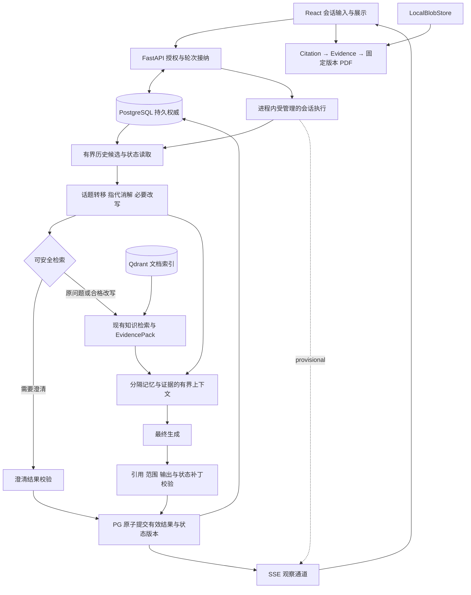

# v0.2 Conversational RAG Architecture Proposal

Status: **PROPOSED / awaiting Human Architecture Review** · 2026-09-28

本提案采用 SDD + Architecture Design Review + Human Gate。它提出可审阅的责任与生命周期契约，不授权实现，也不是 Accepted ADR。v0.2 实现为 **NOT_STARTED**。接受依据为 [Blueprint](V02_BLUEPRINT.md)、[Foundation](V02_FOUNDATION.md)、[Playbook](AI_DEVELOPMENT_PLAYBOOK.md) 与 [Governance](ENGINEERING_GOVERNANCE.md)；本轮不修改这些基线。实际已实现架构继续由 [ARCHITECTURE](ARCHITECTURE.md) 描述。

设计起点已通过 fetch 核实：`main`、`origin/main`、起始 HEAD 同为 `242982abc1c2d03a083ba6d5b51aa42b30ca0550`，工作树干净，公开仓库默认分支 main；公开实现仍为 v0.1.0。分支为 `docs/v0.2-conversational-rag-architecture`。文档布局审计后只新增本页，更新 HANDOFF 与文档地图；不增加伴随文档、历史报告或独立 ADR 文件。

## 1. 审阅摘要与范围

建议由 FastAPI 内的会话协调职责扩展现有 Query Runtime。PostgreSQL 保存原始轮次、Run、不可变上下文记录和有效结果；每个会话同一时刻只接纳一个执行中的轮次。上下文解释在文档检索前完成，历史候选可参与指代与改写。最终结果通过验证后，与有效轮次和新状态版本在同一持久事务提交。SSE 只是观察通道。

会话记忆只解释用户意图。技术事实继续沿 **Answer → Citation → Evidence → 固定版本 PDF** 核验。保留现有知识检索，不建第二记忆数据库或向量库，不增加 Redis 职责，不把每轮对话拆成 Celery 任务。

范围为 session-scoped memory，持久会话可跨浏览器及后端重启继续；这里的 session 是应用 Conversation 身份，不是进程或浏览器连接。跨会话长期个人记忆、多租户 RBAC、v0.3 Tool / Function Calling Runtime 均不在本轮范围。不定义工具接口或为后续 Agent 提前建抽象层。

## 2. v0.1 实际边界与扩展缺口

以下来自基线提交的定向只读检查，不是对未来能力的声明。

| 当前入口 | 已有行为与对设计的约束 |
| --- | --- |
| [api.py](../src/citeweave/api.py) 的 `/v1/queries`、`/v1/runs/{run_id}` | Pydantic 请求与 SSE 响应；由后端创建 Run，按 workspace 读取持久结果。不存在 Conversation API |
| [answering.py](../src/citeweave/answering.py) 的 `begin_query` | workspace + 幂等键与请求指纹；运行中重复请求冲突，终态请求返回原 Run；捕获 READY 文档版本、索引绑定和 runtime profile。已有全局容量及费用预留，不等于会话内排序 |
| 同文件的 `stream_answer`、`finish` | delta 标记 provisional；引用校验后在 PG 写结果与 Citation，再发送 final。当前流取消会记录 `client_cancelled`，并非断线后独立继续运行 |
| [query_runtime.py](../src/citeweave/query_runtime.py)、[provider_phases.py](../src/citeweave/provider_phases.py) | owner / fence / PG deadline 检查；admission 触发过期清理；provider dispatch 先持久化，未知结果阻止自动重复付费调用。不能据此宣称已有会话恢复或物理 exactly-once |
| [domain.py](../src/citeweave/domain.py) | Document 与 Version 分离；QueryRun 保存问题、版本、profile、trace、结果；Citation 关联 Run 与 Evidence。没有会话、有效轮次或对话状态快照 |
| [structural_repository.py](../src/citeweave/structural_repository.py)、[structural_retrieval.py](../src/citeweave/structural_retrieval.py)、[query_evidence.py](../src/citeweave/query_evidence.py) | structural profile 捕获文档范围、版本和结构身份；Dense + BM25 + RRF + BGE、Parent 扩展与有界 EvidencePack。`legacy-v1` / `structural-trace-v1` 显式分读，不能把所有历史 Run 当作都有 EvidencePack |
| [evidence.py](../src/citeweave/evidence.py)、`get_citation`、[pdf-evidence.tsx](../apps/web/src/pdf-evidence.tsx) | 固定 scope、source/canonical hash、span offsets、quote 和 PDF 几何位置；引用合法性不是语义支持，`support_status` 仍是 `not_assessed` |
| [trace.py](../src/citeweave/trace.py)、[structural-trace.tsx](../apps/web/src/structural-trace.tsx) | profile / prompt hash、阶段、候选、调用与错误摘要已有入口；不记录隐藏思维链或原始 provider 错误体 |
| [workspace.tsx](../apps/web/src/workspace.tsx)、[stream.ts](../apps/web/src/stream.ts) | Ask 的问题、草稿、答案是当前页面状态；可通过 Run 链接回看；每次提交新建随机幂等键，AbortController 与连接绑定。不是持久多轮历史 |

新提案需要增加会话 admission / commit 协调、持久历史与解释记录、独立于 SSE 的执行生命周期、恢复入口。现有单轮路由及其取消语义保持兼容；这些扩展只用于显式选择的会话路径。下文所有新增行为均为 PROPOSED。

## 3. 目标架构及责任

箭头是数据依赖，不是每个框对应一个服务、表或模型调用。现有摄取仍为 PG Job / outbox → Redis → Celery → Qdrant 写入 → durable READY 后可见，图中省略，语义不变。

| 责任 | 归属与边界 |
| --- | --- |
| 交互、pending、草稿/最终展示、引用/PDF、刷新恢复 | React / TypeScript / TanStack Query；缓存可丢弃，不决定 accepted 状态；从 OpenAPI 生成类型 |
| 会话身份、接纳、并发仲裁、重试/取消、授权与最终提交 | FastAPI 后端领域协调；网络 I/O 不占长事务，不把业务策略放 provider / 存储 adapter |
| 历史候选、话题、指代、改写、预算与状态补丁 | 后端策略职责；确定性路径优先，必要时共享一次解释模型调用，策略有 profile 身份 |
| 检索 / EvidencePack / Citation | 复用现有文档工作流与 adapter；新的 retrieval query 不改变已有排序公式、EvidenceSpan 或 READY 契约 |
| PostgreSQL | 原始消息、执行状态、有效结果链、输入快照、profile/trace 关联的唯一持久业务权威 |
| Redis / Celery | 保留 broker / 摄取执行边界；会话接纳、锁、结果不依赖 Redis；摘要暂不排入 Celery |
| Qdrant | 现有文档检索的可重建索引；首版没有 conversation vector index |
| LocalBlobStore | 原始 PDF 与 canonical artifacts；与 PG 一起备份，不把摘要写成源文档 |

## 4. 概念身份与真相层次

这些是领域对象关系，不是一对象一表的 DDL 建议。

| 对象 | 所有权、权威及生命周期 |
| --- | --- |
| Conversation | 属于现有 workspace 授权边界；拥有轮次历史、当前有效 head、活动执行槽与会话状态指针。无跨会话隐式记忆读取 |
| Turn / user message | Conversation 下的一次逻辑提交；原文、提交身份和请求意图保留不覆盖。接纳为 durable pending 不等于 accepted；失败原文可追踪，默认不进入有效记忆 |
| assistant result | Turn 的终态结果：有证据回答、合规的证据不足结果或澄清控制结果。草稿不属于 accepted result；每个 Turn 最多一个有效结果 |
| Query Run | 一次执行记录，属于一个 Turn，或为既有无 Conversation 的独立单轮 Run。一个 Turn 可有多个显式 retry Run；每个 Run 的执行 owner/fence 防止旧执行写回；终态结果不重开或覆盖 |
| Conversation State / Working Memory | 对当前实体、任务、约束、话题有效性的结构化投影。内容由历史派生，不是文档事实；PG 中当前指针是“本会话接受了哪一版本”的权威，不代表推断正确 |
| immutable state snapshot | 已发布状态版本，带来源 Turn、前驱和 profile 身份。当前版本可被新版本替代，但历史版本不修改；不能重建后覆盖旧 Run 的输入版本 |
| selected historical context | 每个 Run 实际使用的历史片段/状态条目/摘要版本及顺序、截取范围、选择理由与内容身份。构建前可调整；进入决策/生成的具体输入固定后不可改写。解释输入与最终生成输入分别可定位 |
| Conversation Summary | 从明确历史覆盖范围导出的有损版本化视图；可失效、丢弃和重建。不是唯一历史或 authoritative facts。被历史 Run 使用的版本保留 |
| documentary Evidence | 来自授权不可变 DocumentVersion 的精确 EvidenceSpan，独立于 Conversation 存在。EvidencePack 是一次检索的派生选择；Citation 将具体 Run 输出绑定到它 |

历史答案的身份链为：**Conversation → Turn → accepted Run → 输入 state snapshot + selected context + conversation profile + document scope/bindings + EvidencePack（如该 profile 有）→ Answer/Citation → EvidenceSpan → DocumentVersion/PDF**。另存输出 state snapshot，避免把“结果之后的状态”当作生成时输入。

“不可变”指保留期间不原地改写历史，不意味着禁止经授权的数据删除。若未来删除策略移除了输入，保留受策略允许的缺失/撤回标识，明确不可重放；不能用重建内容冒充原始快照。会话保留/删除政策须在实现前由 Feature Spec 接受。

| 状态层 | 内容与恢复 |
| --- | --- |
| durable truth | 原始提交、Run 终态、有效结果唯一性、快照/输入版本、Citation 关系；PG 恢复 |
| derived/rebuildable | 当前工作记忆投影、摘要、历史候选查找结构、Qdrant；由保留原文重建为新版本。曾影响 Run 的派生版本仍须保存以便检查 |
| frontend cache | 列表、已取回状态、pending 视图与幂等提交凭据；刷新重读 PG 视图，不能上传全量聊天记录覆盖真相 |
| transient runtime | 模型流、取消信号、受限 SSE buffer、任务句柄；丢失只导致中断/重新观察，不能丢失或制造有效轮次 |
| broker/worker transport | 现有 Celery 通知；Redis 丢失不改变会话历史，未来摘要 job 若引入亦由 PG 记录驱动恢复 |

## 5. 一轮请求与最小解释路径

1. 浏览器提交原问题、显式范围/配置选择、幂等身份和所见会话 head。后端授权后，在短 PG 事务中核对 fingerprint、预期 head、活动槽、资源预算，持久化 pending Turn / Run，捕获输入状态及请求范围。请求响应丢失可凭同一幂等身份找回，不靠 SSE 的首帧保存身份。
2. 在固定 head 下，从 recent turns、结构化状态和整个会话中符合条件的历史读取有界候选；只读已接受历史，排除其他 pending / 失败草稿。候选选取不按“先最新若干条再找相关”截断整个可搜索历史。
3. 解释职责读取当前原文、显式约束、候选及来源，产出话题转换、指代绑定/歧义、原问题或改写、拟议状态失效/更新。它们可共享一次模型调用；明确自足的问题走确定性 skip，不要求七次串行 LLM 调用。
4. 后端校验解释结果、范围与改写保真。不能安全消歧则形成澄清控制结果，跳过文档检索与回答模型；不能通过的输出不进入 accepted memory。必要的历史必须在这里可参与指代/改写，不能全部留到检索后才选择。
5. 可安全检索时，使用原问题或合格改写，按当前授权与捕获的文档版本调用现有检索链。模型不能从历史引用扩大 KB、文档或版本权限。查询文本与授权范围是独立输入。
6. 汇合原问题、解释结果、实际选中历史和 EvidencePack，执行整体预算检查；分区序列化后生成 provisional 回答。输出不合格、证据不足、溢出都有可追踪结果，不能把剩余草稿充作 final。
7. 校验结果种类、Citation 物理身份、范围、已能识别的保真/支持违规以及状态补丁来源。短事务再次核对 owner/fence、deadline、活动 Run、head 和当前授权，原子写入有效结果、Citation、输出快照并移动 head / 释放槽。事务成功才发布 final。后续观察只读取已提交结果。

此路径不自发循环检索历史、不断重写或追加模型修复。单次解释不足以消歧时返回澄清。Feature Spec 可在预算内提出有限的候选补取或修复，但须有评测依据，不从架构推导无限 retry。

### 5.1 Topic Shift、Coreference 与 Rewrite 的不同责任

Topic Shift 决定哪些旧假设仍有效；Coreference 把当前指代绑定到有来源的候选实体/任务；Rewrite 把解释结果表达为检索问题。合并调用不合并验证责任：分别记录结果类别与所依据的来源引用，不记录模型隐藏思维链。相关性选择提供解释材料，也接收最终话题过滤；最终生成上下文可比初始候选小。

| 解释结果 | 状态处理；均先 provisional，成功提交后生效 |
| --- | --- |
| 同一话题 | 保留仍适用的实体/约束，当前用户显式修正覆盖对应旧项，并记录 supersession |
| 部分转移 | 对变动的实体、版本、任务或条件做定向替换/失效；未变项须有适用理由，不能整份旧状态自动继承 |
| 完全新话题 | 停用先前 topic-local 假设，建立新活动话题；仅保留用户明确指定且仍适用的会话级约束。文档范围仍由本次请求/显式会话默认确定 |
| 显式返回旧话题 | 定位旧话题及来源 Turn，重审后续修正与当前范围后重新激活相关条目；不回退全局 head，不恢复已撤回或不再授权的事实材料 |
| 转移/指代不确定 | 保留候选引用并请求澄清，不静默选最近的实体 |

约束至少区分话题局部与用户明确的会话范围，带来源、适用范围和失效关系；不把模型自行推断的“用户偏好”永久保留。状态必须可表达删除/替代而不只是 append。因 scope 变化而失效的依据与因 topic 变化失效的假设分别记录。

### 5.2 Rewrite 契约与回退

始终保留 Original Query，存在改写时保留 Rewritten Query；同时冻结输入状态版本、所用历史、显式范围、结果类别和实际用于检索的 query。改写只消解依赖与补全有来源的用户意图，不添加未经用户表达的事实前提。

| 类别 | 可执行动作 |
| --- | --- |
| no rewrite needed | 原文自足，无未解决指代/必要省略；完整使用原文，记录 skipped 原因 |
| rewrite accepted | 消解有明确来源；否定、技术实体、版本、时间、条件与请求文档范围均保留，新增限定可追溯；采用改写 |
| ambiguous → clarification required | 多候选冲突、指代无来源或范围意图不明；保留原文与候选，不猜测，不发起文档事实回答 |
| rewrite unavailable/failed → safe fallback | 仅在后端仍能确认原文独立可检索且无需丢掉必要约束时用原文；否则澄清或可重试失败。不得把“它呢”原样送去检索并假装安全 |

显式 ID / scope 不由自由文本改写；实体、否定、时间、版本及约束保真要有结构化比较和来源检查。能机械检查的先确定性检查，其余语义正确性由后续 Feature/Evaluation Spec 定义检测、拒绝与人工评测方法。这里不宣称程序可完全判定语义等价；检测到关键漂移就阻断，未检出错误是评测风险，不是放宽硬不变量的理由。

## 6. Relevant Memory Selection：A 的简单策略 + B 的持久候选来源

| 方案 | 优点 / 局限 | 建议 |
| --- | --- | --- |
| A. recent window + structured state + deterministic filtering | 便宜、可解释；只读最近窗口会永远漏掉已离开活动状态的旧任务，不能独立满足 topic return | 采用其简单输入组织，不能只靠窗口 |
| B. PostgreSQL-backed candidate retrieval/filtering | 由已有原始历史与来源元数据按会话、话题、实体、任务线索筛选；可跨窗口找回旧条目，易授权与追踪；词义差异/元数据错误会漏召回 | **推荐 A 的输入组织 + B 的跨历史候选读取**，不把 B 等同于立即部署 PG 全文扩展 |
| C. semantic/vector retrieval | 可改善同义表达与隐含主题；增加 embedding/profile、重建、失效、授权及发布负担，语义近邻不等于有效约束 | 延后；必须先证明 A+B 的具体遗漏且复杂度有收益 |

首版候选来源为有界近期轮次、当前有效结构条目、对全会话可定位的历史实体/主题/任务线索以及显式引用的旧轮次。PG 查询与应用内确定性筛选共同控制候选数量、读取成本和实际 context。候选生成不能把“旧”当排除条件；显式返回、实体/任务相关性先于 recency，近期无关项可完全不进入生成上下文。对齐后的相关候选才允许以近期性辅助排序，准确权重和稳定 tie-break 在 Feature/Evaluation Spec 冻结。

候选元数据可以派生，但须带原始 Turn 来源；被淘汰的活动 topic 并不从历史候选中删除。不能依赖不断膨胀的 current state 或唯一一份 summary 才能找到旧话题。若词面/结构无法找到明确指代目标，记录 retrieval miss / ambiguity，而不是用近邻猜测。

记录候选来源、选取/排除类别、候选与输入 token 数、溢出及搜索不完整标记；诊断自身有界，可保存候选上限内的明细与其余计数，而不为 trace 扫描/复制全历史。Evaluation Spec 要有 Recent-Turn-only 对照以及 old-but-relevant/new-but-irrelevant、噪声、topic return 和长会话配对实验。

重评触发：在预注册 dev 对照中，充分的原历史仍存在却反复因同义表达、主题识别或候选截断漏掉关键旧约束；或者 PG 候选访问超出已接受预算。先比较来源元数据/PG 词法读取的改善，再比较向量召回；若需要向量索引，优先评审复用 Qdrant 的隔离可重建索引，仍须独立讨论权限、READY、删除与版本，不据本提案直接实现。

## 7. Summary / compaction 与有界上下文

Summary 是可选的、版本化的有损历史视图，保存其覆盖 Turn 集合/边界、来源内容身份、生成 profile/model 身份及有效性。新摘要不覆盖旧摘要，不删除唯一原始轮次。它压缩上下文，不压缩掉唯一可恢复的业务历史；历史数据库增长与数据保留政策是另一个问题。

首版先支持无摘要也能运行的有界相关历史路径。确有 compaction 收益时，可在请求准备阶段按固定的已接受历史前缀按需生成，并在严格预算内同步完成；也可复用此前合格版本。无需每轮生成、无需阻塞每次最终回答提交、无需一开始增加 Celery job。摘要缺失/过时/失败时退回原始来源的有界选择；若仍无法容纳关键限制，澄清/明确溢出失败，不以错误摘要继续。

摘要发布是独立的派生视图写入，不能改变 accepted head。输出必须对应捕获的历史前缀和 profile；较旧前缀生成完毕后仍可作为该前缀的摘要，不能标成已经覆盖新轮次。话题返回与新用户修正要求重新校验其适用性。损坏、实体/否定遗漏、源被删除或修正时，将摘要标为不可用于新 Run，重新读取原文并生成新版本；历史 Run 保留其实际用过的摘要及后续发现的问题，不回写历史。

Summary 生成的 provider 调用也须具有持久身份、费用/期限约束和未知结果处理；不能因为“可重建”就无限重试。若实现时测量证明同步摘要会显著妨碍已接受延迟目标，并有明确后台收益，才提出 Celery 派生 job：PG 来源快照、去重、fence、取消、失效与恢复契约必须先获审阅。这个替代不是本轮默认方案。

### 7.1 Context assembler 契约

assembler 接收当前原文、解释结果、近期轮次、选中相关历史/状态、可选摘要、授权 EvidencePack，以及模型输出预留。它对整个模型输入负责；文档 EvidencePack 自己有界不能证明加入对话后仍有界。

- 当前用户显式条件与当前授权优先；源自历史的假设不能覆盖它们。去重时保留来源与 supersession，不用最后出现顺序决定真相。
- Memory 与 documentary Evidence 分区、有类型且带来源；历史里的 `[E1]` 是原 Run 的局部标签，不能当成本轮引用或注入当前 EvidencePack。
- 分别对候选读取、解释输入、可选摘要输入、生成输入和输出预留计量；使用明确 tokenizer / 计量版本，同时记实际采用的片段、顺序、截取与丢弃原因。
- 允许压缩/剔除非关键历史，不能静默切掉否定、范围或必要指代前提；不能截断引用 quote 后仍沿用旧 offsets，也不能为给 memory 腾空间静默破坏既有 EvidencePack 的覆盖契约。
- 如旧检索 profile 的完整 EvidencePack 加最小对话条件仍不适配，显式 overflow / clarification / failure；需要改变证据预算时提出新的 profile 与回归审阅，不偷改旧排名和 pack 语义。

Feature Spec 冻结优先级、截断单位、用户可见 overflow/fallback；Feature 与 Evaluation Spec 在实现前共同冻结各阶段 token、输出、调用次数、整会话成本/延迟预算及计量方法。本轮不给 token 数、阈值或性能承诺。

## 8. 有效轮次、并发、重试与取消

### 8.1 两个提交点与一种有效结果

**admitted**：原始消息与 Run 已写 PG，可刷新找回；尚未被接受为后续记忆。**accepted**：一个合格终态结果及其状态快照与 head 在同一事务完成。无论执行/通知发生多少次，同一 Turn 最多产生一个有效 accepted result；失败或取消的 Turn 可以没有有效结果。这是业务结果幂等，不声称外部模型只执行一次。

建议串行 admission，而非排队后自动按新上下文运行：每个 Conversation 最多一个活动 Turn/Run。第二个独立提交遇 busy 或 head 已变时返回可恢复冲突，客户端保留输入并刷新；不静默排队、合并或重定基。不同会话仍受现有全局容量/费用约束，不新增吞吐承诺。

状态演进概念上为 pending → executing → accepted，或 failed/cancelled/interrupted/stale；这些名称不是冻结 API enum。前置解释、检索和生成只产生 provisional state patch。接受提交必须同时满足：

- Conversation 仍可写且属于当前 principal；当前访问策略仍允许使用捕获来源。
- 当前活动 Run、预期 accepted head / 输入状态、执行 owner/fence 全部匹配，PG deadline 未过期。
- 结果类型和验证通过；accepted result 尚不存在；最终 Citation 只引用本 Run 授权 Evidence。
- 原子持久化最终结果、Citation 关系、输出 state snapshot 与输入关联，更新 head 并释放活动槽。

不能先完成 Run 再靠另一个无恢复保障的异步步骤推进 Conversation。任何写失败都不发布 final；提交结果不明时按幂等身份读回 PG 判定，不能直接再调用 provider。实现阶段选择事务/唯一性约束的具体表达，但必须证明这些原子条件。

head 检查也须覆盖被独立修改的状态/会话控制版本：纠错重建、关闭/删除、会话默认 scope 等变更不能在 head 不变时逃过校验。新请求捕获的 scope 不受另一标签页临时 UI 选择影响；真正改变该活动执行前提的服务端操作，必须与提交串行仲裁并使旧执行失效，不能把新设置套入已开始的 Run。

### 8.2 场景矩阵

| 场景 | 规定的有效结果与恢复责任 |
| --- | --- |
| 两个标签页或紧邻两次提交 | PG 短事务仲裁活动槽与 expected head；只接纳一个。另一输入仍由客户端保留，刷新后明确重新提交；后端不自动换上下文 |
| 同 key 同 fingerprint 重复提交 | 找回同 Turn/Run 与当前状态；运行中只观察，不启动第二执行；终态重放同结果。fingerprint 包括会话、原文、scope、profile 与预期 head 等语义输入 |
| 同 key 不同内容 | 明确冲突，不覆盖消息或复用错误结果；admission 冲突未创建 Turn 时，不算失败业务轮次 |
| SSE 断线 / 浏览器刷新或重启 | v0.2 会话执行在受管理的进程内任务中继续至期限；连接断开不等于取消。重连读取 PG Conversation/Run；不承诺逐 token 补发，缺失 delta 不影响 final |
| provider timeout / 结果未知 | Run 失败或 interrupted；已派发调用按现有 UNKNOWN 原则保留不确定费用，不自动再次付费，不提交 state。迟到响应无资格恢复为 accepted |
| 用户明确 retry | 创建关联同 Turn 的新 Run，旧 Run 留存；只能在原输入 head/scope 仍适用、没有其他活动轮次且该 Turn 未 accepted 时重试。head 已前进则需以当前状态明确新建 Turn，不默默重放旧假设 |
| retry 操作本身重复 | 同一 retry 幂等身份只创建同一个新 Run；每次用户明确的新 retry 有新操作身份。次数/费用由未来预算约束，UNKNOWN 不冒充自动安全重试 |
| 用户取消 | 后端在 PG 仲裁取消与提交；取消先获胜则失效执行权并释放槽，best-effort 停 provider；迟到内容只可留诊断。final 提交先获胜则返回已完成，不能把已接受结果回滚为 cancelled |
| 取消/失败后新轮次推进，旧结果迟到 | Run fence、活动槽与 head 检查共同拒绝旧成功/失败写回；旧执行的 cleanup 也不能释放新 Run 的槽。保留失效原因，不把旧回答追加到历史末尾 |
| 后端重启 / task 丢失 | PG 保存 pending 与 deadline；启动时及相关状态读取/admission 时执行幂等 reconciliation。确认执行已失效或期限到达后标 interrupted 并 fencing/释放槽；不能仅因连接失效判另一进程仍有效的任务死亡。未知结果不自动再发 |
| admission 成功但未启动执行 | 同样由期限/reconciliation 收敛；重连可看到 pending 后转 interrupted，再显式 retry。首版不承诺自动跨重启续算 |
| final 已提交但 SSE final 丢失 | PG 读回同一 accepted result，不能因前端没看到 final 新建有效结果 |
| PG 不可用 / 提交超时 | 停止接纳或提交；不从内存宣布 final。恢复后先查 durable outcome，再 fencing/收敛；provider 可能已计费，但会话真相不猜测 |

PG deadline 限制活动槽占用；状态读取触发 reconciliation 的语义应使刷新可发现中断，而不是永远显示 RUNNING。没有新的用户访问时，记录可暂保持待收敛；再次读取/接纳时必须先收敛，不能依赖新增后台调度器才保证正确性。具体启动扫描、锁顺序与进程关闭实现留给生命周期 Feature Spec。

进程内受管理任务指有明确所有权、总期限、异常收口、关闭处理及受限观察缓冲的 runtime 责任，不是无跟踪的 fire-and-forget coroutine。跨 API 进程的观察可通过 PG 状态读回最终结果；实时草稿丢失可接受，Redis pub/sub 或持久 token 日志不是本轮必需。若将来要求跨重启自动完成、可靠后台交付或规模化调度，才重评 Celery 执行。

### 8.3 State update 时点与控制结果

| 时点 | 取舍 |
| --- | --- |
| 生成前更新 accepted state | 不采用：歧义、失败或取消会把猜测永久写入 |
| 检索后更新 accepted state | 不采用：找到证据不等于得到合格回答，也不保证状态补丁正确 |
| 仅 final 后另起无关联状态写入 | 不采用：回答成功而状态更新丢失，会使下一轮基于不一致历史 |
| provisional patch + 合格 final 的原子接受 | **推荐**：前面可计算补丁但不生效；验证后一起提交，失败可完整保留诊断且不推进 accepted head |

澄清是有效的控制结果，可推进 turn head，并仅保存待澄清的原问题、候选来源与未解决状态；它不能选定歧义实体或输出伪文档事实。用户下一条澄清回复是新的 Turn，显式关联待解决问题。证据不足结果也可被接受，但只更新已明确的用户意图/约束，不把“本次没有找到”推成“文档不存在该事实”。

状态补丁优先从显式用户输入、已验证解释及来源关系确定性构建，不从自由格式 assistant prose 抽取“事实”。无法通过来源/结构/冲突检查的补丁不能提交；可用保守的、可验证最小补丁完成，否则整个轮次失败。语义无效或已识别不受支持的模型输出不得接受；自动检查不能穷尽语义错误，必须通过后续评测验证，不能将物理 Citation 校验称为语义证明。

若后来发现已接受回答有语义错误，记录关联的 invalidation/correction 并排除其派生假设用于未来 Run；生成新状态版本，不篡改原答案、输入和当时的接受记录。纠错 UI 与重建策略归 Feature Spec；关键违规仍按 Governance 计为阻断，不靠标记失效抹去失败。

## 9. Memory / Evidence 信任与授权范围

Conversation memory、Summary、推断实体和 assistant 历史回答都只是上下文。即使过去答案有合法 Citation，本次文档事实仍须从当前授权 scope 获取对应不可变 Evidence，并纳入本 Run 的 pack/引用验证。历史摘要不能获得 Evidence ID；历史用户提出的事实前提也不是技术证据。Memory/文档中的指令视为数据，不能变更系统策略、授权范围或跳过校验。

| 范围变化 | 本轮与历史的处理 |
| --- | --- |
| KB / document scope 改变 | Conversation 属 workspace；每个 Turn 捕获有效 KB/文档请求范围及来源（本次显式选择或显式保存的默认）。允许显式换 KB，但重新授权、重审相关状态；缺省不是所有历史 KB 的并集 |
| 历史引用可回看、当前范围排除该文档 | 当前 principal 仍有历史查看权限时，原 Run 可展示旧引用/PDF；此权限不允许把它放入当前查询。UI 的范围选择不等同于永久撤销阅读权限 |
| 权限真正被撤销 | 对会话、Run、选中历史、引用/PDF 及含来源文本的结果视图重新应用当前访问政策；历史快照不能绕过权限。必要时遮蔽/拒绝正文，不只禁止 PDF 下载 |
| 文档新版本替换 / 旧版本 retired | 新查询仍按现有可用版本规则捕获；旧 Run 保持旧身份。历史实体/版本条件不能偷偷映射成新版；用户明确要求旧版但当前检索不支持时澄清/不可用，不扩大行为 |
| 源文档删除 / 物理内容丢失 | 不替换成相似新证据、不悄悄重绑 Citation。返回明确不可用/受限；保留受策略允许的身份。恢复 PG + blobs 可恢复可用性，缺失时不能宣称完整 replay |
| 执行中授权改变 | 提交前再校验，权限撤销必须阻止 accepted 发布；未来授权变更实现需与提交检查有一致的仲裁边界，不能仅靠进程缓存。无完整 RBAC 实现的当前基线不能被宣称已有此能力 |

历史可用性、当前查看授权、当前查询 scope 是三个不同问题。删除/保留 Feature Spec 必须先处理已引用不可变来源：正常 retirement 保留引用依赖，已接受 Citation 的物理解析保持 **100%**；不能通过偷偷删除依赖使不变量变成“尽力”。若真正的数据擦除要求优先于保留，就显式撤回受影响结果的可用/有效声明、提供缺失标识并走 Human Gate，不能把不可解析引用仍声明为合格 final。源缺失是完整性故障或已声明的撤回，不计作通过。

## 10. Trace、重放与评测入口

每个 conversational Run 至少能检查以下输入、决策与输出；正常 UI 只展示用户可理解的轮次状态与引用，其余进入 Runs / Trace。

| 记录组 | 必需身份/内容与用途 |
| --- | --- |
| 轮次与执行 | Conversation / Turn / Run、retry 关系、输入 head、owner/fence、admission/commit/取消/失效类别，判定唯一有效结果 |
| 问题与解释 | Original Query、可选 Rewritten Query、实际 retrieval query、rewrite used/skipped/fallback、topic transition、实体绑定/歧义及其来源；不保存隐藏推理 |
| 对话输入 | 输入 state snapshot、解释所见候选与最终选择、具体历史片段/顺序/内容身份、Summary 版本与覆盖区间、排除/截断/overflow 计数和理由 |
| 授权与文档 | 请求范围、当时有效范围、固定版本/索引绑定、retrieval profile、候选与 EvidencePack、最终 Citation/Answer；当前访问限制另记，不能覆写当时 scope |
| 策略版本 | 独立 conversation profile/revision，memory/state/summary/context 策略版本，prompt 内容哈希与可定位版本、模型/provider 身份、tokenizer/输出预算、已有 retrieval profile |
| 结果与运行 | 输出 state snapshot、验证结果、阶段时长/错误分类、调用数、usage/费用及 unknown、生成/提交时点；失败在何处停止及哪些字段尚未产生 |

受授权的持久输入记录保存所选片段和已公开 prompt 模板身份/哈希，或者可严格定位的不可变内容引用，使相同输入可重组；仅存摘要式自然语言解释或一个无对应内容的 hash 不足以重放。通用日志只保存去敏身份/计数/错误类别，不把完整私有对话、provider 原始请求/错误或密钥写入日志与公共 CI。Trace 访问与原会话/来源同受授权和保留政策控制。

区分三种 replay：历史查看读取已提交结果；输入重建按旧 snapshot/profile/pack 重组，不重新选记忆；重新执行创建新的 Run 与对照关联，重查当前授权并记录不可用来源。模型随机性、模型版本不可用或索引重建可能导致重新执行不同，不承诺输出逐字一致，也不能用新 profile 改写旧 Run。需要改变 context/trace 格式时增加 reader revision，沿用当前显式 legacy reader 原则。

### 10.1 Evaluation hooks（不定义 Evaluation Spec）

| 未来评测维度 | 此架构提供的可观察量 |
| --- | --- |
| Coreference / rewrite fidelity | 原文、绑定实体与来源、改写/skip/fallback、显式约束及被使用状态 |
| Topic shift / topic return | 输入/输出 snapshot、失效/保留/重新激活关系及来源 Turn |
| Relevant history / history noise | 候选来源、选中/排除/截断、使用的片段；可插入无关或错误旧回答比较 |
| Old-but-relevant / new-but-irrelevant | 跨窗口源身份与选择理由、recency 元数据、同 profile 下的配对结果 |
| Long conversation | 各阶段 token/候选边界、summary coverage、溢出、fallback、原历史可恢复性 |
| Single-turn regression | 无 Conversation 路径、固定旧 profile/语料/模型条件、显式 conversation skip，可与 v0.1 baseline 比较 |
| Citation / Evidence integrity | Run → Pack → Citation → EvidenceSpan → Version/PDF 身份及授权；语义支持与物理合法分开判定 |
| 并发/恢复风险 | 重复身份、head/fence、取消/提交顺序、迟到拒绝与有效结果数，供确定性故障测试 |

保留 **physical Citation → Evidence resolution = 100%**、**0 accepted critical evidence/semantic boundary violations**。可观察钩子不是已通过这些门槛的证据。本轮不生成数据、运行 provider、确定样本数、rubric、评分算法或其他数值门槛；合成案例也不能证明通用质量。

## 11. v0.1 兼容与未来迁移

Conversation 是显式可选能力。现有单轮 Ask、`/v1/queries` 的请求/事件/幂等行为、旧 Run reader 与 Citation → PDF 路径继续成立；不强制为每个旧 Run 回填一个伪会话。新会话路径需要单独、明确的 opt-in 契约，具体采用新路由或可版本化入口由 Feature Spec 决定，不能靠给旧 payload 默默添加不同取消语义。

v0.2 会话的“断线后仍执行、显式取消才停止”与旧单轮 stream-cancel 不同，必须在新路径说明并验收；若将来统一到旧 API，则是要另行审阅的公开行为变更，本提案不授权。引用身份、文档检索排序、现有 profile 的预算及解释不改变。新的会话 trace reader 必须与旧 `legacy-v1` / `structural-trace-v1` 共存。

未来持久概念至少涉及 Conversation/head/活动执行、Turn/幂等提交与 retry 关系、Run 的可选会话关联、输入/输出状态版本、选择上下文、Summary 版本和策略身份。具体表、字段、索引及唯一约束表达留给实现设计，**所有 durable schema 变化必须 Alembic**。现有 Run 不应被新默认值伪装成曾使用会话上下文；可选关联和显式 reader 兼容性应在迁移测试中证明。

迁移前在隔离环境备份 PG 与 LocalBlobStore，验证从 v0.1 数据升级、旧 Run 展示、新写入、重启、重复提交及备份恢复。Qdrant 可按固定 source/profile 重建；重建身份若改变须新建可识别绑定，不修改历史 Run。Redis 不是恢复会话的备份来源。代码回滚不等于数据降级：应优先保留可向前兼容的旧 reader；无法安全 downgrade 时采用 forward fix 或停写后恢复匹配的 PG/blobs 备份，明确备份之后的数据损失风险。

恢复时先收敛失去执行者的 Run、重查来源完整性，再开放会话新写入；不恢复旧 fence 的执行权，不自动重发 UNKNOWN provider 请求。本轮不创建迁移、不跑服务、不操作旧 RAGFlow 容器/卷。当前包/API 历史版本与公开 v0.1.0 的映射继续沿用 Governance，v0.2 发布前单独审阅。

## 12. 故障责任与恢复清单

本表补充第 8 节竞态矩阵，规定由谁修复，避免把“有 trace”当成已恢复。

| 故障 | 立即行为 | 恢复责任 / 历史处理 |
| --- | --- | --- |
| 候选漏选、话题/改写漂移 | 无法安全解释则澄清；已检测关键漂移则阻断 | 后端解释/选择职责；Trace 定位首个错误阶段，后续 dev 实验，不覆盖旧选择 |
| 状态或摘要损坏 | 禁用受影响投影；禁止把猜测当作有效输入 | 后端状态职责按原始已接受消息与修正关系重建新版本；缺少原文则明确不可恢复 |
| Qdrant 不可用 / captured build 不一致 | 沿现有 profile 的显式失败/fallback，不用历史回答代替 Evidence | 检索/索引运维重建并按 READY 发布；PG 与原始 bytes 保持权威 |
| Evidence / PDF 缺失或身份不符 | 阻断合格 final 或历史来源读取，记录完整性失败 | Evidence/存储职责恢复原 bytes，不能重绑定到新版“修复” |
| 生成/状态补丁/引用校验失败 | Turn 无 accepted result，状态 head 不动 | runtime 保存安全错误类别并释放自身执行槽；用户可按第 8 节显式 retry |
| Summary 生成失败 | 可忽略派生优化，改用有界原历史；仍不足则明确失败 | 摘要职责记录失败/费用；独立重建，不回滚已成功的历史回答 |
| 提交后通知丢失 / 前端缓存陈旧 | 读 PG，校验当前 head；不重复执行 | 前端恢复与 backend status read，共同消除本地 pending 假象 |
| API 进程失效 / provider 未知 | 期限内只观察；失效后 fencing，禁止迟到提交 | 后端 reconciliation；保存 UNKNOWN 与费用不确定性，无无限后台 retry |
| 历史来源权限变化 | 拒绝/遮蔽受影响读取和新查询使用 | 后端授权职责；取消/提交与权限变更按一致边界仲裁，历史身份不重写 |
| Redis/Celery 不可用 | 现有摄取按既有恢复语义处理；会话不借用 broker 作为真相 | 原摄取职责；不得据此删除会话、全局重置 Docker 或重建无关资源 |

## 13. 重要取舍与重评条件

以下都是待审阅建议；已接受的信任/基础设施方向不重开，比较用于解释最小实现边界。

| 决策 | 推荐与为何适合 v0.2 | 认真考虑的替代及代价 | 重评条件 |
| --- | --- | --- | --- |
| 状态权威与历史表示 | PG 原文 + 版本化投影 + Run 输入引用；利用既有事务并能解释历史 | 全量 event sourcing 可更细重放但增加事件兼容/投影运维；仅保存最新 JSON 简单却不能解释旧答案 | 实际复杂编辑/分支/审计需求超出不可变版本链；先提出新的生命周期需求 |
| 结果提交 | pending/provisional 与 accepted 分离，结果/状态/head 原子提交 | 异步最终状态更新可缩短主路径，但需额外可恢复提交协议；提前写入会污染失败轮次 | 测量到状态计算/写入妨碍预算且有证明安全的可恢复协议 |
| 并发 | 每会话一个活动轮次，expected head 冲突明确返回 | 排队自动重定基、乐观并行分支或多结果合并能提高交互并发，却引入语境漂移/分支 UX | 产品明确要求并行追问/分支，并接受如何选择父状态的行为 |
| SSE 与执行 | 新会话受管理进程内执行 + PG 终态恢复，断线只是观察中断 | 沿用断线即取消最简单但刷新容易丢有效尝试；Celery 执行可跨进程交付但增加队列/调度/stream 协调 | 明确要求跨重启自动完成或后台长任务，且重试/费用/延迟目标可验证 |
| 解释路径 | 确定性 skip + 可合并的 topic/coreference/rewrite；历史先参与解释 | 分阶段模型调用更可单独优化但延迟/费用/失败面增加；纯规则对复杂省略不足 | 预注册误差分析指出合并职责无法可靠区分失败，且拆分有收益 |
| 历史选择 | A+B：recent/state + PG 跨历史候选；Relevance first | 纯 recent-window 漏旧上下文；向量检索增加失效、权限与评测复杂度 | 第 6 节漏召回或成本触发条件成立，控制实验支持升级 |
| 摘要 | 可选派生、按需有界、保留来源与旧版本；不每轮阻塞 | 滚动唯一 summary 便宜但错误积累不可恢复；每轮/Celery 自动摘要增加工作和一致性负担 | 已接受长会话预算无法满足、同步压缩影响延迟且后台有收益 |
| 文档事实边界 | 记忆只给意图，事实从本轮授权 Evidence 支持 | 直接复用已引用旧答案省检索，但旧范围/版本/错误会被带入新结果 | 不重开 Memory 非 Evidence 原则；只在可证明当前授权/版本/身份有效时研究 Evidence 复用优化 |
| Scope 与历史查看 | 每轮捕获范围 + 读取/提交重新授权；历史可用与当前可用分开 | 固定会话 KB 更简单但限制显式切换；历史快照永久授权有泄漏风险 | 产品要求固定 KB、版本回查或新撤权/删除能力，提交对应 Feature Spec |
| Context 分区与预算 | 保留来源的分区 assembler，整体预算与旧 pack 契约均校验 | 直接拼完整聊天记录简单但不可控；统一截断所有文本易损坏条件和引用 | tokenizer/model/场景变化影响预算，须新 profile 与回归，不能取消有界原则 |
| 控制结果 | 澄清/证据不足是可接受的类型化结果，只更新受限意图状态 | 只把事实回答计为有效轮次简单，但刷新后澄清问题及待解决关系缺失 | Feature Spec 选择不同交互流程时仍须保留 durable 控制结果与不污染事实的边界 |
| Trace/profile | 新 conversation profile 与已有 retrieval profile 分离、显式 revision reader | 用单个大 profile 或覆盖当前配置更省字段，却模糊新旧策略并破坏解释 | 策略组合确实造成维护困难时调整表示，仍须冻结实际输入身份 |
| v0.1 兼容 | 会话 opt-in，旧单轮及 reader 保留 | 全量自动会话化 UI 更统一，但改写旧取消/重放行为和迁移解释 | 另一次明确接受的公开行为迁移，提供弃用与数据恢复方案 |

## 14. Foundation ADR 候选处置

本轮不创建 Accepted ADR，也不增加重复的候选文件。本页已包含候选的建议、替代、后果和迁移影响，足以作为 Human Review 表面。获得针对精确文档版本的接受记录后，再创建长期 ADR。

| Foundation 候选 | 建议处置 | 应记录的长期边界 / 本轮不固化内容 |
| --- | --- | --- |
| 会话状态权威及有效轮次提交 | **Human Review 后创建**；把并发/取消/fence/SSE 恢复合入同一候选 | 第 4、8、11 节的持久身份、原子接受、retry 及恢复；迁移须新增关联与约束，不冻结 DDL |
| 记忆与文档证据的信任及范围边界 | **Human Review 后独立创建** | 第 9 节的 Memory 非 Evidence、scope、历史查看/撤权、引用依赖保留；信任边界不与调参算法混写 |
| 有界上下文、摘要与相关历史选择契约 | **Human Review 后创建**；保持三个主题在同一 ADR，不拆成三份 | 第 6、7 节的可恢复原文、有界输入、相关性优先与派生 summary；具体阈值、排名与 prompt **defer** 到 Spec |
| 对话 profile / trace 的版本语义 | **Human Review 后独立创建** | 第 10、11 节的旧 Run 不重解释、输入/输出版本与 reader；不与状态 ADR 合并，以覆盖跨策略诊断和兼容读者 |

四项候选均有独立长期后果，暂不 drop；不为每个实现类增加 ADR。若 Human Review 缩减 v0.2 范围，可合并/延后具体内容，但不能自行宣告接受。

## 15. 明确延期到后续阶段的决定

| 阶段 / 未来 Spec 责任 | 必须在相应实现或调参前确定 |
| --- | --- |
| Feature Spec：会话生命周期与恢复 | 创建/命名/删除/保留 UX，scope 默认及切换交互，澄清与证据不足展示，冲突/retry/cancel 按钮，断线恢复、状态刷新、SSE 事件契约；架构上的 durable head / 原子提交 / 失效 fencing 不推迟 |
| Feature Spec：解释与历史上下文 | topic/coreference/rewrite 的具体可观察行为、保真/支持验证与 fallback、候选/排序/去重规则、约束有效期与纠错、Summary 触发、截断/overflow，用户可见记忆行为 |
| Feature + Evaluation Spec：预算 | 所有阶段 token 上限、输出预留、调用数、整会话费用与时延边界、有限 retry、计量版本；数字须有依据，不能实现后再选 |
| Evaluation Spec | 数据集组成/许可/分组 split、case 数、baseline 实验、Recent-Turn-only 对照、指标实现及分母、失败/N/A 分类、Judge rubric、人工复核、概率质量数值门槛、单轮容忍度与最终发布 gate；完整 protocol 在结果用于决策/调参前冻结 |
| Implementation design（须已有接受范围） | 表/列/索引/唯一性表达、Alembic、精确 Pydantic payload/路由、生成 TS 类型、React 组件、进程任务与取消实现、锁顺序/恢复扫描、最终 prompts、评分公式及 tokenizer 代码 |

无论延期哪些细节，不能以“等 Evaluation 再说”为由允许未验证草稿 final、范围扩大或重复有效结果。反过来，本轮也不把架构建议包装成已经证明质量/性能的实现。

## 16. Architecture acceptance criteria 与审阅定位

下表衡量提案是否可审阅，不代表系统已通过运行验收。实现测试应在后续 Spec 固化。

| 人工审阅必须能回答 | 本提案的答案位置 / 后续需证明的行为 |
| --- | --- |
| 什么是 durable truth，什么可重建 | 第 3、4 节：PG 原文/有效结果/版本关系，派生投影与前端/运行态分离 |
| 什么时候 user turn accepted | 第 8 节：区别 admission 与结果原子接受；澄清/证据不足有明确受限状态 |
| 失败、取消、迟到如何处理 | 第 8、12 节：不推进 head，执行失效 fencing，明确提交/取消竞态与 deadline recovery |
| 话题、指代、改写如何分工 | 第 5 节：可组合调用、分别记录和校验，相关历史先参与解释，明确安全原文 fallback |
| 如何找旧而相关历史且保持简单 | 第 6 节：A+B 跨窗口候选，无新数据库，质量/成本触发再评估 C |
| Memory 如何不变成 Evidence | 第 7、9 节：分区和来源类型、本轮 Evidence/Citation 校验、scope 与访问分开 |
| 长会话如何有界且能恢复 | 第 7 节：可选有损 Summary、原始历史保留、各阶段/整体预算与显式 overflow |
| Trace 如何解释影响某 Run 的上下文 | 第 10 节：冻结输入 snapshot/选择/摘要/profile，记录决策结果而非隐藏思维链 |
| v0.1 如何保持兼容 | 第 2、11 节：可选会话入口、旧 API/reader/Run 身份保持，迁移/备份待验证 |
| 哪些决定仍是 Feature/Eval 工作 | 第 15 节：行为、具体协议、数据/rubric/预算/数值门槛与实现结构明确分开 |
| 哪些长期决定值得 ADR | 第 14 节：四个候选及接受后处置，未创建 Accepted ADR |
| 如何避免已接受方向漂移 | 未替换检索、未扩大长期记忆或 v0.3 范围；硬不变量保留，无新任意概率阈值 |

后续最小风险验证需覆盖双客户端并发、同 key 重复、取消与 final 竞态、提交前后进程丢失、UNKNOWN provider、旧 head retry、权限/范围变化、损坏 summary、旧上下文找回、实际引用/PDF 身份与 v0.1 回归。本轮不运行这些尚不存在的会话实现测试，也不拿离线 CI 替代它们。

## 17. Human Architecture Review 决策与最大风险

未发现与已接受 Blueprint/Foundation/Governance 冲突；无需改写基线。下面是本提案真正需要 Product Owner 接受/修改的架构选择，不是开始写提案前的阻塞问题：

| 决策 | 推荐默认；若不接受的影响 |
| --- | --- |
| 同一会话并发交互 | 接受一个活动轮次 + 明确冲突，不自动队列/分支；若要求并行，必须先定义父状态与用户选择行为 |
| 断线与重启保证 | 新会话断线继续、显式取消；重启保证历史与终态可恢复，不保证自动续算；若要求后台必达，需重新审阅执行机制 |
| 有效控制结果与原子状态 | 接受澄清/证据不足也可形成有效轮次，但不承认新的文档事实；最终结果与状态原子提交 |
| 历史/摘要与兼容 | 接受 A+B 首版、Summary 可选有损且保留原文、会话 opt-in、旧 Run 不重解释；向量记忆与自动摘要任务须后续证据 |

数据保留/实际擦除的产品政策与具体澄清/范围 UX 尚未确定，属于实现前的 Feature Human Gate，不妨碍当前架构审阅；本提案已规定删除不能悄悄破坏有效引用或授权，不能以该延期作为上线授权。

最大的三个风险：

1. **语义污染与改写漂移**：来源可追溯也可能推断错误，Citation 合法不证明支持。以类型/范围/约束检查阻断可识别错误，保留控制结果与失败，靠冻结的多轮/单轮人工评测验证，不能承诺自动全知校验。
2. **原子接受与执行恢复不一致**：SSE、取消、PG 提交、provider 迟到可能不同步。以单活动槽、expected head、Run fence、PG 事务和 deadline reconciliation 限制有效结果；实现必须做真实持久竞态/重启测试。
3. **有界选择丢关键旧约束或压缩失真**：简单 A+B 可能漏同义旧任务，Summary 可能丢否定。保留原文、选择/截断/摘要身份和对照钩子，安全失败/澄清，并按第 6、7 节的证据触发升级，不声称无需进一步评测。

Human Review 应针对 Draft PR 的精确 commit 记录决策主题、接受/拒绝/有条件接受、条件、决策人及日期，遵循 Playbook。CI 成功、Draft PR 存在、没有回复均不等于接受。**在 Human Architecture Review 门禁停止；不等待决议，不创建 Accepted ADR，不开始 Feature 实现，不 merge / tag / Release。**
