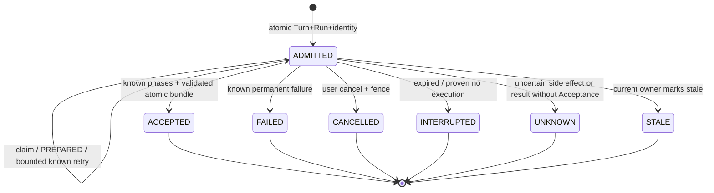

# ADR0023 — durable Conversation reliability and recovery

Status: Owner mission authorized implementation; independent implementation review complete, Human Implementation Review pending. 2026-10-03.

Retain Champion8184 and the existing Run statuses. ADMITTED is an active lease; a durable execution claim distinguishes admitted from executing. PREPARED / DISPATCHED / COMPLETED / REJECTED / UNKNOWN in the existing provider ledger distinguish provider stages. CANCELLED persists user intent independently of unresolved provider accounting. INTERRUPTED denotes expired ownership with known no external execution; UNKNOWN blocks redispatch, including known transport success without Acceptance. ACCEPTED is the only published result.

PG owns every transition. Locks remain Conversation first; all Acceptance/head/Run and cancellation/fence changes commit atomically. Acceptance checks DB time after both bundle insertion and final Run/event flush, so a slow final write cannot publish after its deadline. Redis and Celery are not inserted into synchronous query execution.

Bounded transport retries require explicit server policy, finite authorization capacity reserved for all allowed attempts, direct proof of non-execution and a durable attempt fence. Timeout after DISPATCHED, HTTP5xx, partial stream and lost receipt are UNKNOWN; a connection exception after any received HTTP response (including response cleanup) cannot prove non-execution; no automatic redispatch. Backoff uses bounded exponential full jitter; deadline/cancellation is rechecked at each attempt. The phase's dispatched_at is the current attempt's timestamp for pinned-rate estimation; append-only events retain all preceding attempt timestamps. A crash never causes the same Run to automatically execute again.

Cancellation acquires the same Conversation lock as Acceptance. Whichever commits first determines the result: accepted remains accepted, cancellation wins otherwise and advances the fence. In-flight ledger dispatch is conservatively settled UNKNOWN with reservation retained. Late workers cannot overwrite the result/accounting under an obsolete fence.

Recovery scans a finite expired-run batch and delegates to the existing locked reconcile function. It never guesses provider safety from age alone, dispatches, or installs a timer. PREPARED/no dispatch or proven retryable rejection → INTERRUPTED; possible dispatch/completed call without Acceptance → UNKNOWN; a durable permanent rejection → FAILED. Cancelled/accepted runs remain unchanged. Future operators may explicitly retry an INTERRUPTED Turn using the existing core seam and a fresh authorization.

Migration0013 is additive: execution claim, immutable retry capacity and attempt/classification scheduling fields on existing rows, an append-only Run event table, deferred status/Acceptance consistency checks and immutable Acceptance bundles. No historic grant/campaign/result is backfilled or changed. Existing historical one-call rows have retry limit1; their new attempt0 denotes absent new instrumentation, not proof of zero historical calls. No new authorization follows from migration.

Alternatives: Redis locks lose admission/accounting on cache loss; Celery task state cannot certify provider outcomes; generic exception retries double-call UNKNOWN; a second Run state machine duplicates durable truth. All rejected. A provider receipt payload store could enable local completion recovery, but retaining raw model outputs adds privacy/validation obligations; this milestone blocks known results without Acceptance conservatively instead.

| Transition | Predecessor / ownership | Durable transaction | Redispatch |
| --- | --- | --- | --- |
| admit / claim | new unique key / current owner+head+fence+deadline | Turn+Run; then once-only claim | claim cannot repeat |
| prepare / dispatch | owned active Run; finite grant; known-safe attempt | phase reserve; dispatch commits before I/O | only PREPARED or explicitly proven bounded rejection |
| receipt | matching current phase/attempt/owner/fence/deadline | phase observation + event | UNKNOWN/COMPLETED forbid send |
| accept | active owner+scope+head+deadline; no unresolved phase | bundle+head+Run+fence+event | terminal, never |
| cancel | authorized client, active Run; no worker ownership needed | phase uncertainty+Run CANCELLED+fence+event | terminal; unresolved reservation blocks retry |
| failure | current owner/fence; conservatively classify provider history | Run FAILED or UNKNOWN+fence+event | no automatic new Run |
| recover | expired active Run under current Conversation lock | ledger reconcile+Run+fence+event | never dispatches |

The original strict Interpretation/Acceptance authority is unchanged. Provider-free tests prove transport/state invariants on synthetic inputs, not semantic support, physical exactly-once delivery or provider billing.
